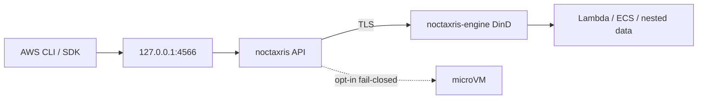

# Noctaxris

**Run AWS-shaped security labs on your laptop without a cloud bill or a host Docker socket.**

```bash
docker compose -f docker/compose.yaml --env-file docker/.env up --build
curl http://127.0.0.1:4566/_noctaxris/health
curl http://127.0.0.1:4566/_noctaxris/ready
# ok
```

SigV4 endpoint on `127.0.0.1:4566`. Point the AWS CLI at it and exercise the lab services in the table below the way you would against real AWS.

Repo and Go module: [`github.com/Kyaxris-Labs/Noctaxris`](https://github.com/Kyaxris-Labs/Noctaxris). Images ship under [Kyaxris-Labs](https://github.com/Kyaxris-Labs).

## Why this exists

| | |
|---|---|
| Lab fidelity | Identity evaluation with boundaries, SCP/RCP filters, PassRole, and condition keys |
| Secure defaults | Loopback publish only. No host `docker.sock`. Sealed secrets and CMK material at rest |
| Nested compute | DinD via Compose `noctaxris-engine` is the default. Opt-in microVM on Linux with KVM. WSL2 stays DinD-only |
| CLI-shaped | Latest AWS CLI v2 via `--endpoint-url` |

## Quick start

Copy env, start Compose, hit health, then call STS and S3.

```bash
cp docker/.env.example docker/.env
# edit docker/.env root access keys if you want non-example values

docker compose -f docker/compose.yaml --env-file docker/.env up --build

curl http://127.0.0.1:4566/_noctaxris/health
curl http://127.0.0.1:4566/_noctaxris/ready

export AWS_ACCESS_KEY_ID=AKIAROOTEXAMPLE01
export AWS_SECRET_ACCESS_KEY='wJalrXUtnFEMI/K7MDENG/bPxRfiCYEXAMPLEKEY'
export AWS_DEFAULT_REGION=us-east-1
EP=http://127.0.0.1:4566

aws configure set default.s3.addressing_style path
aws sts get-caller-identity --endpoint-url "$EP"
aws s3 mb s3://lab-bucket --endpoint-url "$EP"
aws kms create-key --endpoint-url "$EP"
```

Use the same root keys you put in `docker/.env`. Full per-service CLI smoke lives under [docs/services/](docs/services/index.md).

## Services

<table>
  <thead>
    <tr>
      <th>Area</th>
      <th>Services</th>
      <th>Detailed actions</th>
      <th>Not implemented</th>
    </tr>
  </thead>
  <tbody>
    <tr>
      <td rowspan="4" align="center" valign="middle">Identity</td>
      <td>IAM</td>
      <td>Users, roles, managed and inline policies, managed policy versions (max five), access keys, groups, permissions boundaries, instance profiles, OIDC and SAML IdP CRUD, virtual MFA.</td>
      <td>Service-linked roles, full pagination and tagging parity.</td>
    </tr>
    <tr>
      <td>STS</td>
      <td>All 11 actions (lab MFA on GetSessionToken).</td>
      <td>Deeper AssumeRoot, DecodeAuthorizationMessage, GetDelegatedAccessToken, and GetWebIdentityToken parity.</td>
    </tr>
    <tr>
      <td>Organizations</td>
      <td>CreateAccount, ListAccounts, OUs, MoveAccount, EnablePolicyType, SCP and RCP create/attach/detach/describe. SCP/RCP collection walks account, OU path to root, and root. Identity, boundary, SCP, and RCP apply on shared authorize and dataplane paths.</td>
      <td>Account invites and handshake control-plane beyond MoveAccount.</td>
    </tr>
    <tr>
      <td>Cognito User Pools</td>
      <td>Pool and app client CRUD, AdminCreateUser / SignUp / ConfirmSignUp, InitiateAuth USER_PASSWORD_AUTH, RS256 ID and access tokens, JWKS on <code>/cognito-idp/REGION/POOL/.well-known/jwks.json</code>.</td>
      <td>Identity Pools, Hosted UI, full SRP, MFA depth, refresh revoke APIs.</td>
    </tr>
    <tr>
      <td rowspan="1" align="center" valign="middle">Crypto</td>
      <td>KMS</td>
      <td>Customer-managed keys, key policies (same-account key-policy-required, cross-account identity and key policy both Allow), Encrypt/Decrypt/GenerateDataKey*/ReEncrypt, grants, aliases (including lab alias/aws/s3|dynamodb|sqs), ScheduleKeyDeletion/CancelKeyDeletion (cancel leaves Disabled), on-read sweeper after DeletionDate, key-material rotation (enable rotates sealed material, lab auto-rotate by period).</td>
      <td>Sign/Verify, MAC, asymmetric/HMAC specs, import, multi-Region, RotateKeyOnDemand API shape, tags, cross-account grant flows, true AWS-owned managed keys.</td>
    </tr>
    <tr>
      <td rowspan="15" align="center" valign="middle">Data</td>
      <td>S3</td>
      <td>Path-style buckets and objects, bucket policy (same-account identity or policy, cross-account both Allow), SSE-S3/SSE-KMS, presigned GET/PUT, multipart upload (5 MiB min non-final parts), CopyObject (same account), bucket default encryption, versioning lite (Put/GetBucketVersioning, version-aware Get/Put, ListObjectVersions lite).</td>
      <td>Lifecycle, virtual-hosted style, ACL cross-account, delete markers depth, multipart presign.</td>
    </tr>
    <tr>
      <td>DynamoDB</td>
      <td>Tables, item CRUD, Query/Scan with up to two lab GSIs, BatchGet/BatchWrite, table resource policies (same-account or, cross-account and), CMK encryption, TTL configure and lazy expiry. Stream enablement for DynamoDB Streams lab core.</td>
      <td>More than two GSIs, LSI, Transactions, PartiQL, global tables.</td>
    </tr>
    <tr>
      <td>DynamoDB Streams</td>
      <td>Enable stream on table (NEW_IMAGE or KEYS_ONLY), ListStreams/DescribeStream, GetShardIterator/GetRecords. Change records on Put/Update/DeleteItem when enabled.</td>
      <td>OLD_IMAGE views, parallel shard fan-out, Lambda ESM for streams.</td>
    </tr>
    <tr>
      <td>SQS</td>
      <td>Standard and FIFO queues, send/receive/delete (batch and visibility), deduplication, queue policies (same-account or, cross-account and), SSE-SQS and SSE-KMS, RedrivePolicy to DLQ with RedriveAllowPolicy enforcement, DelaySeconds (queue and per-message).</td>
      <td>High-throughput FIFO quotas, StartMessageMoveTask parity.</td>
    </tr>
    <tr>
      <td>SSM Parameter Store</td>
      <td>String and SecureString parameters, Put/Get/GetParameters/GetParametersByPath/Delete/Describe, path hierarchy with Recursive, KMS via KeyId or alias/aws/ssm, identity EvaluateFull authz.</td>
      <td>StringList types, parameter policies, labels, tags, full pagination parity.</td>
    </tr>
    <tr>
      <td>Secrets Manager</td>
      <td>Create/Get/Put/Delete/Restore/Rotate/Describe/List, resource policies (same-account or, cross-account and), KMS via alias/aws/secretsmanager, recovery window on delete (7-30 days) with on-read sweeper, lab RotateSecret (random replacement, no Lambda rotator).</td>
      <td>Lambda-backed rotation, version stages, tags, replication.</td>
    </tr>
    <tr>
      <td>SNS</td>
      <td>Topic CRUD including FIFO (<code>.fifo</code>, MessageGroupId/dedup), Publish, Subscribe and Unsubscribe (including XA Subscribe to foreign topic ARNs), List*, Get/SetTopicAttributes, Add/RemovePermission, topic policies (same-account or, cross-account and), confirmed sqs/lambda delivery (destination policy must Allow sns.amazonaws.com; foreign SQS ARNs supported) plus loopback HTTP(S) catcher (deny-by-default egress).</td>
      <td>SMS, email, open-internet webhooks, filter policy depth, foreign Lambda subscription endpoints, exact AWS retry timing.</td>
    </tr>
    <tr>
      <td>EventBridge</td>
      <td>Default and custom buses, Put/Describe/List/Delete/Enable/Disable Rule, Put/Remove/List Targets, PutPermission/RemovePermission, PutEvents with lab pattern match (source, detail-type, simple detail keys) and bus-policy dual-eval (bus ARN for XA). Targets SQS, Lambda, SNS, CloudWatch Logs, Kinesis, Step Functions (Logs/Kinesis/SFN require RoleArn). PassRole plus events.amazonaws.com trust on PutTargets RoleArn. Lab InputPath and InputTransformer on delivery.</td>
      <td>Archive and replay, legacy scheduled rules, full pattern language, InputPath bracket/wildcard notation, resource-policy delivery for Logs/Kinesis/SFN.</td>
    </tr>
    <tr>
      <td>EventBridge Scheduler</td>
      <td>Distinct Scheduler API: Create/Get/Update/Delete/ListSchedules. Rate plus small cron subset and optional <code>at(...)</code>. Targets Lambda, SQS, SNS. PassRole for scheduler.amazonaws.com. In-process ticker.</td>
      <td>Flexible windows, full retry/DLQ matrix, schedule groups depth, universal targets.</td>
    </tr>
    <tr>
      <td>EventBridge Pipes</td>
      <td>Create/Describe/Delete/ListPipes. Source SQS, DynamoDB Streams, or EventBridge bus to target Lambda or SQS. Optional Lambda Enrichment. PassRole for pipes.amazonaws.com when RoleArn set. Continuous in-process ticker plus PollPipeOnce. RoleArn session or target resource policy on deliver.</td>
      <td>Filter partner matrix, enrichment HTTP destinations, cross-account bus sources.</td>
    </tr>
    <tr>
      <td>S3 Vectors</td>
      <td>Vector bucket and index CRUD, PutVectors / QueryVectors with in-process cosine or euclidean ranking. Identity authz.</td>
      <td>Full condition-key matrix, huge dimensional indexes, metadata filter depth.</td>
    </tr>
    <tr>
      <td>RDS</td>
      <td>CreateDBInstance / DescribeDBInstances / DeleteDBInstance for engine <code>postgres</code>. Nested Postgres via DinD data-plane helper when engine is up. Nested-network endpoint only. Master credentials in Secrets Manager.</td>
      <td>MySQL, Multi-AZ, read replicas, Aurora full cluster matrix, host-published Postgres ports.</td>
    </tr>
    <tr>
      <td>RDS Data API</td>
      <td>ExecuteStatement on <code>:4566</code>. Requires resourceArn and secretArn. Real SQL via nested <code>psql</code> when instance is available; otherwise DatabaseUnavailableException (no canned SELECT). Begin/Commit/Rollback return 501.</td>
      <td>Wire-protocol <code>pgx</code> executor (buy-in), BatchExecuteStatement, full result type matrix, real SQL transactions.</td>
    </tr>
    <tr>
      <td>ElastiCache</td>
      <td>CreateCacheCluster / DescribeCacheClusters / DeleteCacheCluster for redis or valkey. Status creating until nested Valkey/Redis starts; available only with engine. Nested-network endpoint only.</td>
      <td>Cluster mode / replication group matrix, Redis AUTH depth, MemoryDB, host-published cache ports.</td>
    </tr>
    <tr>
      <td>DocumentDB</td>
      <td>CreateDBCluster / DescribeDBClusters / DeleteDBCluster (<code>Engine=docdb</code>). Nested Mongo-compatible image when DinD is up. Nested-network endpoint only. Not Neptune.</td>
      <td>Neptune, change streams, full TLS client auth matrix, host-published document ports.</td>
    </tr>
    <tr>
      <td rowspan="3" align="center" valign="middle">Audit and tags</td>
      <td>CloudTrail</td>
      <td>LookupEvents over local <code>cloudtrail/events.jsonl</code> with time and attribute filters.</td>
      <td>CreateTrail, selectors, Insights, Lake, delivery to S3 or Logs, cross-account lookup.</td>
    </tr>
    <tr>
      <td>CloudWatch Logs</td>
      <td>Create/DeleteLogGroup, Create/DeleteLogStream, DescribeLogGroups/DescribeLogStreams, PutLogEvents/GetLogEvents, Put/Delete/DescribeSubscriptionFilters to Lambda or SQS (lab substring filter). Identity EvaluateFull authz.</td>
      <td>Metric filters, Insights, FilterLogEvents, CloudWatch filter syntax, cross-account observability.</td>
    </tr>
    <tr>
      <td>Resource Groups Tagging API</td>
      <td>TagResources, UntagResources, GetResources with TagFilters and ResourceTypeFilters over a lab ARN tag map.</td>
      <td>Resource Groups CRUD, GroupBy, tag policy compliance, service-native tag API parity.</td>
    </tr>
    <tr>
      <td rowspan="7" align="center" valign="middle">Streams and delivery</td>
      <td>Kinesis Data Streams</td>
      <td>Create/Delete/Describe/ListStreams, PutRecord/PutRecords, GetShardIterator/GetRecords on a single lab shard.</td>
      <td>Multi-shard split/merge, enhanced fan-out, encryption depth, Kinesis Data Analytics.</td>
    </tr>
    <tr>
      <td>Firehose</td>
      <td>Delivery stream CRUD, PutRecord/PutRecordBatch. S3 destination writes objects. Lambda ARN destination persists records and enqueues async Invoke. PassRole for firehose.amazonaws.com; Put evaluates RoleARN session or destination resource policy.</td>
      <td>OpenSearch/HTTP destinations, dynamic partitioning, live Lambda Invoke from delivery.</td>
    </tr>
    <tr>
      <td>Amazon MQ</td>
      <td>CreateBroker/DescribeBroker/ListBrokers/DeleteBroker. EngineType ActiveMQ or RabbitMQ. <strong>Control-plane stub</strong> with loopback <code>stub://</code> endpoint; BrokerState CREATION_FAILED; PubliclyAccessible=true rejected. No nested broker, no WAN ports.</td>
      <td>Nested DinD broker, MSK/Kafka, full admin APIs, public broker endpoints.</td>
    </tr>
    <tr>
      <td>Transfer Family</td>
      <td>CreateServer/DescribeServer/ListServers/DeleteServer, CreateUser/DeleteUser. SFTP-shaped sandbox under the data root. Describe reports VPC/OFFLINE (no listener).</td>
      <td>AS2, FTPS depth, IdP integration, WAN expose, live SFTP listener.</td>
    </tr>
    <tr>
      <td>SES</td>
      <td>VerifyEmailIdentity (lab auto-verify), SendEmail/SendRawEmail catcher, ListIdentities, GetSendStatistics stub. No outbound SMTP.</td>
      <td>Real relay, receipt rules, configuration sets, SES v2 depth.</td>
    </tr>
    <tr>
      <td>AppConfig</td>
      <td>CreateApplication/Environment/ConfigurationProfile, hosted configuration versions, GetConfiguration, AppConfigData StartConfigurationSession/GetLatestConfiguration.</td>
      <td>Deployment strategies, validators, extensions, feature-flag profile depth.</td>
    </tr>
    <tr>
      <td>Step Functions</td>
      <td>Create/Delete/Describe/List state machines, StartExecution/DescribeExecution/GetExecutionHistory. ASL Pass/Succeed/Fail and Task to Lambda (sync Invoke), SQS, SNS, or EventBridge bus. EventBridge can StartExecution with RoleArn. PassRole with states.amazonaws.com when RoleArn set.</td>
      <td>Choice/Wait/Parallel/Map, Express workflows, InputPath/ResultPath depth, Scheduler Task resources.</td>
    </tr>
    <tr>
      <td rowspan="10" align="center" valign="middle">IaC, edge, and governance</td>
      <td>CloudFormation</td>
      <td>CreateStack/DescribeStacks/DeleteStack/ListStacks. JSON templates with AWS::S3::Bucket and AWS::IAM::Role. Unknown types fail closed. Optional PassRole for cloudformation.amazonaws.com.</td>
      <td>YAML templates, intrinsic matrix, ChangeSets, nested stacks, broader resource catalog.</td>
    </tr>
    <tr>
      <td>Cloud Control</td>
      <td>CreateResource/GetResource/ListResources/DeleteResource for AWS::S3::Bucket and AWS::IAM::Role. Unknown types fail closed. Sync ProgressEvent SUCCESS.</td>
      <td>Broader type catalog, async operation polling depth.</td>
    </tr>
    <tr>
      <td>Glue</td>
      <td>Data Catalog database and table CRUD over sqlite (Create/Get/GetDatabases/GetTables/Delete*). Tables store PartitionKeys plus StorageDescriptor SerDe/InputFormat fields for Athena. Identity authz.</td>
      <td>Crawlers, ETL jobs, Lake Formation, partition value registration.</td>
    </tr>
    <tr>
      <td>WAF v2</td>
      <td>Create/Update/Get/List WebACL, CreateRuleGroup, AssociateWebACL to lab HTTP API / execute-api / ALB / AppSync / Cognito / Lambda function ARNs (fail closed on unknown), invoke-path DefaultAction gate, labeled Evaluate helper. No real edge PoP.</td>
      <td>Real PoP / CAPTCHA / Bot Control, full statement catalog.</td>
    </tr>
    <tr>
      <td>Config</td>
      <td>PutConfigurationRecorder, PutDeliveryChannel (existing S3 bucket), StartConfigurationRecorder (recording flag + ConfigurationRecorderStarted SNS; no history PutObject), DescribeComplianceByConfigRule returns NOT_APPLICABLE. Optional PassRole for config.amazonaws.com.</td>
      <td>Configuration history to S3, managed rule catalog, remediations, aggregator, organization rules.</td>
    </tr>
    <tr>
      <td>ACM</td>
      <td>RequestCertificate/DescribeCertificate/ListCertificates/DeleteCertificate. Lab self-signed PEM via stdlib. No public CA.</td>
      <td>Real public CA, live DNS validation propagation, imported cert workflows beyond Put.</td>
    </tr>
    <tr>
      <td>Route 53</td>
      <td>CreateHostedZone/DeleteHostedZone/ListHostedZones, ChangeResourceRecordSets/ListResourceRecordSets for A and CNAME. Identity authz.</td>
      <td>Alias targets to CloudFront/ELB, traffic policies, Resolver endpoints.</td>
    </tr>
    <tr>
      <td>Cloud Map</td>
      <td>CreatePrivateDnsNamespace or HTTP namespace, CreateService, RegisterInstance/DeregisterInstance, DiscoverInstances.</td>
      <td>Full DNS integration with Route 53, health checks depth.</td>
    </tr>
    <tr>
      <td>CloudFront</td>
      <td>CreateDistribution/GetDistribution/ListDistributions/DeleteDistribution. Origins as S3 bucket or API Gateway API id strings. No real PoP.</td>
      <td>Real CDN edge, signed cookies depth, multi-behavior matrices.</td>
    </tr>
    <tr>
      <td>ELB v2</td>
      <td>CreateLoadBalancer/CreateTargetGroup/CreateListener/Describe*/Delete*. Target types lambda or ip only. RegisterTargets for Lambda ARN. No EC2.</td>
      <td>ALB Cognito auth action, path routing depth, listener invoke data path.</td>
    </tr>
    <tr>
      <td rowspan="8" align="center" valign="middle">Compute</td>
      <td>Lambda</td>
      <td>Zip or Image CreateFunction through UpdateConfiguration, PublishVersion and aliases, layers (max 5, <code>/opt</code> on zip and Image Invoke), sync and async Invoke (Event with SQS DLQ/OnFailure), SQS and DynamoDB Streams event source mappings with in-process poller and lab FilterCriteria, Function URLs lite (NONE with simple CORS or AWS_IAM on <code>/lambda-url/...</code>), runtimes <code>python3.11</code>/<code>python3.12</code>/<code>nodejs20.x</code>, Invoke qualifiers, AddPermission/GetPolicy/RemovePermission (lab foreign principals, same-account or / cross-account and), ImageUri pull of lab ECR <code>127.0.0.1:4566/ACCOUNT/REPO:tag</code> with Registry V2 auth, PassRole plus <code>lambda.amazonaws.com</code> trust, nested DinD with TLS (no host <code>docker.sock</code>), opt-in microVM selection via <code>NOCTAXRIS_COMPUTE_RUNTIME=microvm</code> (Linux/KVM probe, fail-closed, live guest boot deferred), platform egress deny.</td>
      <td>Kinesis/MQ ESM sources, full content-filtering operators beyond lab FilterCriteria, ReportBatchItemFailures, provisioned concurrency, weighted aliases, Function URL CORS config object depth, service-principal cross-account grants, EventBridge failure destinations, non-lab private registries, rootless engine, live Firecracker guest zip/Image Invoke on Linux+KVM, full SAR depth.</td>
    </tr>
    <tr>
      <td>ECR</td>
      <td>Create/Describe/DeleteRepository, GetAuthorizationToken, repository policies (same-account or, cross-account and), PutImage/BatchGetImage/ListImages/BatchDeleteImage, Registry V2 on <code>127.0.0.1:4566</code> with token auth, DinD sync on manifest put for ECS and Lambda Image.</td>
      <td>Scanning, replication, lifecycle, OCI referrers depth, chunked PATCH uploads, public galleries.</td>
    </tr>
    <tr>
      <td>ECS</td>
      <td>Register/Describe/List/DeregisterTaskDefinition (requires taskRoleArn and executionRoleArn), RunTask/Describe/List/Stop, CreateService/UpdateService/DeleteService/DescribeServices/ListServices with DesiredCount lab reconciler, DescribeClusters/ListClusters, PassRole plus <code>ecs-tasks.amazonaws.com</code> trust, nested DinD on <code>noctaxris-ecs</code> Internal network, task-role credential injection, opt-in microVM selection via <code>NOCTAXRIS_COMPUTE_RUNTIME=microvm</code> (same Linux/KVM fail-closed matrix as Lambda, live guest boot deferred).</td>
      <td>Load balancers, awsvpc ENI, capacity providers, ECS Exec, Service Connect, live Firecracker guest RunTask on Linux+KVM, full SAR depth.</td>
    </tr>
    <tr>
      <td>CodeBuild</td>
      <td>CreateProject, StartBuild, BatchGetBuilds, ListBuilds. Inline or S3 buildspec. PassRole with codebuild.amazonaws.com. Nested DinD via the shared compute client (no host <code>docker.sock</code>).</td>
      <td>VPC, fleets, CodeCommit, batch build matrix, artifact publishing depth.</td>
    </tr>
    <tr>
      <td>CodePipeline</td>
      <td>CreatePipeline/GetPipeline/DeletePipeline, StartPipelineExecution, GetPipelineState. Requires at least one CodeBuild action. StartPipelineExecution calls nested CodeBuild StartBuild for each ProjectName. Optional PassRole for codepipeline.amazonaws.com.</td>
      <td>Full action catalog, approvals, cross-region.</td>
    </tr>
    <tr>
      <td>CodeDeploy</td>
      <td>CreateApplication/CreateDeploymentGroup/CreateDeployment/GetDeployment/ListDeployments. Sync Succeeded. Optional PassRole for codedeploy.amazonaws.com. Optional ECS DesiredCount refresh or Lambda PublishVersion when a group stores those targets.</td>
      <td>Blue/green traffic shifting, EC2 agent, on-premises instances.</td>
    </tr>
    <tr>
      <td>Batch</td>
      <td>CreateComputeEnvironment, CreateJobQueue, RegisterJobDefinition, SubmitJob, Describe*. PassRole for batch.amazonaws.com service role and ecs-tasks.amazonaws.com job role. Nested DinD SubmitJob.</td>
      <td>Array/multi-node jobs, fair-share, Fargate/EC2 capacity fidelity.</td>
    </tr>
    <tr>
      <td>AppSync</td>
      <td>Create/Get/List/DeleteGraphqlApi, schema store, CreateApiKey, Lambda data source plus one Query resolver, GraphQL POST that Invokes Lambda. Auth API_KEY, AWS_IAM, or AMAZON_COGNITO_USER_POOLS (Bearer JWT via lab Cognito JWKS).</td>
      <td>Amplify, subscriptions/MQTT, full GraphQL spec, AppSync JS/VTL runtimes, OIDC beyond Cognito.</td>
    </tr>
    <tr>
      <td rowspan="1" align="center" valign="middle">API edge</td>
      <td>API Gateway HTTP API</td>
      <td>CreateApi/CreateIntegration/CreateAuthorizer/CreateRoute/CreateStage. Lambda AWS_PROXY only. Route auth NONE, JWT (Cognito JWKS), or AWS_IAM (<code>execute-api:Invoke</code>). Optional CredentialsArn PassRole for apigateway.amazonaws.com. Invoke on <code>/http-api/{apiId}/{stage}/{path}</code>.</td>
      <td>REST API v1, WebSocket, HTTP_PROXY, Lambda authorizers, HTTP API resource policies.</td>
    </tr>
    <tr>
      <td rowspan="6" align="center" valign="middle">Analytics and AI</td>
      <td>Athena</td>
      <td>StartQueryExecution / GetQueryExecution / GetQueryResults / StopQueryExecution. In-process SELECT subset over Glue catalog plus lab S3 CSV/JSON. Missing S3 location buckets fail closed. Optional ResultConfiguration OutputLocation.</td>
      <td>Full SQL, CTAS, federated catalogs, nested Trino/Presto/Spark.</td>
    </tr>
    <tr>
      <td>OpenSearch</td>
      <td>CreateDomain / DescribeDomain / ListDomainNames / DeleteDomain. <strong>Control-plane stub</strong> loopback <code>stub://</code> endpoint. No nested OpenSearch.</td>
      <td>Nested DinD OpenSearch cluster, full query DSL proxy, fine-grained access control.</td>
    </tr>
    <tr>
      <td>EMR</td>
      <td>RunJobFlow / DescribeCluster / ListClusters / TerminateJobFlows <strong>control-plane stub</strong>. No host Spark/Hadoop.</td>
      <td>Full step matrix, nested Spark engines, EMR Serverless and Studio.</td>
    </tr>
    <tr>
      <td>Bedrock Runtime</td>
      <td>InvokeModel over allowlisted modelIds with canned JSON. Unknown modelId fails closed. No real foundation models.</td>
      <td>Converse, streaming, Agents, Guardrails, real model runtimes.</td>
    </tr>
    <tr>
      <td>Textract</td>
      <td>DetectDocumentText and AnalyzeDocument over Bytes or lab S3Object. Canned PAGE/LINE/WORD Blocks. No real OCR.</td>
      <td>Async analysis APIs, Queries/Forms/Tables depth, real OCR.</td>
    </tr>
    <tr>
      <td>Transcribe</td>
      <td>StartTranscriptionJob / GetTranscriptionJob / ListTranscriptionJobs. Requires existing lab <code>s3://</code> media object. Canned transcript under the data root. No real ASR.</td>
      <td>Streaming transcription, Call Analytics, writing transcripts into lab S3.</td>
    </tr>
    <tr>
      <td rowspan="4" align="center" valign="middle">Billing</td>
      <td>Pricing</td>
      <td>DescribeServices/GetAttributeValues/GetProducts over a tiny static embedded price list. Identity authz.</td>
      <td>Live AWS price list sync.</td>
    </tr>
    <tr>
      <td>BCM Data Exports</td>
      <td>CreateExport/GetExport/ListExports/DeleteExport. Sample CSV/JSON under the data root. Identity authz.</td>
      <td>Scheduled CUR delivery to S3, Parquet variants.</td>
    </tr>
    <tr>
      <td>Cost Explorer</td>
      <td>GetCostAndUsage and GetCostForecast over seeded lab amounts. Identity authz.</td>
      <td>Live AWS CE sync, anomaly detection, rightsizing recommendations.</td>
    </tr>
    <tr>
      <td>Budgets</td>
      <td>CreateBudget/DescribeBudget/DescribeBudgets/DeleteBudget. SNS subscriber ARNs under NotificationsWithSubscribers receive one lab LAB_CREATE Publish on CreateBudget (not ACTUAL).</td>
      <td>Budget actions that mutate accounts, RI/SP coverage, live CE-driven ACTUAL/FORECASTED threshold evaluation.</td>
    </tr>
  </tbody>
</table>

Per-service APIs, authz notes, and CLI smoke: [docs/services/](docs/services/index.md).

## Defaults

| Setting | Value |
|---------|--------|
| Listen | `127.0.0.1:4566` only |
| Docker | No host `docker.sock` (nested `noctaxris-engine` for Lambda, ECS, CodeBuild, Batch, and nested data engines) |
| Compute runtime | Default `dind`. Opt-in `NOCTAXRIS_COMPUTE_RUNTIME=microvm` on Linux with KVM and a Firecracker binary. WSL2 is DinD-only. Missing KVM or binary fails closed. Nested data engines stay on DinD |
| Data ports | Compose publishes only `127.0.0.1:4566`. No host publish of Postgres, Redis/Valkey, Mongo, or OpenSearch |
| API replicas | **One process per data root.** Multi-replica against the same SQLite volume is unsupported and can corrupt state |
| Credentials | Root keys via env injection |
| At rest | Secrets and CMK material sealed under the data volume |
| Authn | SigV4 on AWS API paths except documented open/alternate-auth routes (health, ready, JWKS, federation STS, Function URL NONE, HTTP API NONE, AppSync auth types) |
| Function egress | Platform deny on `noctaxris-fn` (unlike AWS Lambda default internet) |

Backup, restore, upgrade, graceful shutdown, and CI matrix (PR `smoke-core` vs manual nested smoke): [docs/ops.md](docs/ops.md).

## Architecture

Loopback API only. Nested DinD over TLS. No host `docker.sock`. Full graph and request path: [docs/architecture.md](docs/architecture.md).



## Docs

Architecture, configuration, ops, and security posture: [docs/index.md](docs/index.md).

## Author

[](https://github.com/Kyaxris-Labs)
[](https://github.com/Kyaxris-Labs/Noctaxris)

## License

[MIT](LICENSE)
