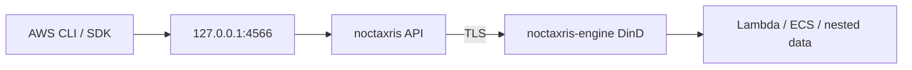

<p align="center">
  
</p>

<p align="center">
  <b>Run AWS-shaped security labs on your laptop without a cloud bill or a host Docker socket.</b>
</p>

```bash
docker pull kyaxris/noctaxris:latest
# Container bind is 0.0.0.0; generate unique roots (shipped example pair is refused).
ROOT_AKID="AKIA$(openssl rand -hex 8 | tr '[:lower:]' '[:upper:]')"
ROOT_SECRET="$(openssl rand -hex 32)"
docker run -d --name noctaxris -p 127.0.0.1:4566:4566 \
  -e NOCTAXRIS_LISTEN=0.0.0.0:4566 \
  -e NOCTAXRIS_ALLOW_NONLOOPBACK_LISTEN=1 \
  -e NOCTAXRIS_ROOT_ACCESS_KEY_ID="$ROOT_AKID" \
  -e NOCTAXRIS_ROOT_SECRET_ACCESS_KEY="$ROOT_SECRET" \
  kyaxris/noctaxris:latest
curl http://127.0.0.1:4566/_noctaxris/health
# ok
```

<p align="center">
  <a href="https://github.com/Kyaxris-Labs/Noctaxris/actions/workflows/ci.yml"></a>
  <a href="https://hub.docker.com/r/kyaxris/noctaxris"></a>
  <a href="https://hub.docker.com/r/kyaxris/noctaxris/tags"></a>
  <a href="LICENSE"></a>
</p>

Point the AWS CLI or SDK at it and call the lab services the same way you would against real AWS.

Go module: [`github.com/Kyaxris-Labs/Noctaxris`](https://github.com/Kyaxris-Labs/Noctaxris). Image tags: `latest`, semver releases, and `nightly` from CI.

## Why this exists

| | |
|---|---|
| Lab fidelity | Identity evaluation with boundaries, SCP/RCP filters, PassRole, and condition keys |
| Secure defaults | Loopback publish only. No host `docker.sock`. Secrets and CMK material sealed at rest |
| Nested compute | DinD via Compose `noctaxris-engine` over TLS. Live Invoke needs a healthy engine. Default engine is restricted (`privileged: false` + caps/cgroup); use `compose.engine-privileged.yaml` only if nested smoke fails on your host |
| CLI-shaped | Latest AWS CLI v2 via `--endpoint-url` |

## Quick start

Pull the Hub image, run it on loopback `:4566`, then hit STS and S3 with the same root keys you passed in.

```bash
docker pull kyaxris/noctaxris:latest

# Container bind is 0.0.0.0; generate unique roots (shipped example pair is refused).
ROOT_AKID="AKIA$(openssl rand -hex 8 | tr '[:lower:]' '[:upper:]')"
ROOT_SECRET="$(openssl rand -hex 32)"

docker run -d --name noctaxris -p 127.0.0.1:4566:4566 \
  -e NOCTAXRIS_LISTEN=0.0.0.0:4566 \
  -e NOCTAXRIS_ALLOW_NONLOOPBACK_LISTEN=1 \
  -e NOCTAXRIS_ROOT_ACCESS_KEY_ID="$ROOT_AKID" \
  -e NOCTAXRIS_ROOT_SECRET_ACCESS_KEY="$ROOT_SECRET" \
  kyaxris/noctaxris:latest

curl http://127.0.0.1:4566/_noctaxris/health
curl http://127.0.0.1:4566/_noctaxris/ready

export AWS_ACCESS_KEY_ID="$ROOT_AKID"
export AWS_SECRET_ACCESS_KEY="$ROOT_SECRET"
export AWS_DEFAULT_REGION=us-east-1
EP=http://127.0.0.1:4566

aws configure set default.s3.addressing_style path
aws sts get-caller-identity --endpoint-url "$EP"
aws s3 mb s3://lab-bucket --endpoint-url "$EP"
aws kms create-key --endpoint-url "$EP"
```

Nested Lambda, ECS, and data engines need Compose with `noctaxris-engine`. Copy `docker/.env.example` to `docker/.env`, replace both root values with unique lab credentials, then `docker compose -f docker/compose.yaml --env-file docker/.env up --build`. Default host publish is `127.0.0.1:4566` only. Opt-in loopback TCP for selected nested data ports: add `-f docker/compose.lab-nested-ports.yaml` (see [ops.md](docs/ops.md#compose-overlays-lab-opt-in)). Per-service CLI smoke: [docs/services/](docs/services/index.md).

## Services

| Area | Services |
|------|----------|
| Identity | IAM, STS, Organizations, Cognito User Pools |
| Crypto | KMS |
| Data | S3, DynamoDB, DynamoDB Streams, SQS, SSM, Secrets Manager, SNS, EventBridge, Scheduler, Pipes, S3 Vectors, RDS, RDS Data API, ElastiCache, MemoryDB, DocumentDB, Neptune |
| Audit and tags | CloudTrail, GuardDuty, Security Hub, Detective, Macie, VPC Flow Logs (lab; see EC2), CloudWatch Logs, CloudWatch Metrics/Alarms, Resource Groups Tagging API |
| Streams and delivery | Kinesis, Firehose, Amazon MQ, MSK, Transfer Family, SES, AppConfig, Step Functions |
| IaC, edge, and governance | CloudFormation, Cloud Control, Glue, WAF v2, Config, ACM, Route 53, Cloud Map, CloudFront, ELB v2, Control Tower (stub) |
| Compute | Lambda, ECR, ECS, EC2 (lab nested), EKS, CodeBuild, CodeCommit, CodePipeline, CodeDeploy, Batch, AppSync |
| API edge | API Gateway REST, HTTP API, WebSocket lab lite |
| Analytics and AI | Athena, OpenSearch, EMR, Bedrock Runtime, Textract, Transcribe |
| Billing | Pricing, BCM Data Exports, Cost and Usage Reports, Cost Explorer, Budgets |
| Devices | IoT Core / IoT Data (HTTP shadows) |
| Control plane labs | Lightsail, Auto Scaling, Elastic Beanstalk, AWS Backup |

Expand for detailed actions and gaps. Full notes and CLI smoke: [docs/services/](docs/services/index.md).

<details>
<summary><b>Service matrix</b> (detailed actions / not implemented)</summary>

<table>
  <thead>
    <tr>
      <th>Area</th>
      <th>Services</th>
      <th>Detailed actions</th>
      <th>Not implemented</th>
    </tr>
  </thead>
  <tbody>
    <tr>
      <td rowspan="4" align="center" valign="middle">Identity</td>
      <td>IAM</td>
      <td>Users, roles, managed and inline policies, managed policy versions (max five), access keys, groups, permissions boundaries, instance profiles (including ListInstanceProfilesForRole), OIDC and SAML IdP CRUD, virtual MFA, GetAccessKeyLastUsed, GenerateCredentialReport / GetCredentialReport (lab CSV).</td>
      <td>Out of lab scope: service-linked roles, full pagination and tagging parity. PassRole trust <code>aws:SourceArn</code> on Lambda, EventBridge PutTargets, ECS, Scheduler, Pipes, Secrets rotate, API Gateway CredentialsArn, and Cognito trigger RoleArn.</td>
    </tr>
    <tr>
      <td>STS</td>
      <td>All 11 actions (lab MFA on GetSessionToken).</td>
      <td>Out of lab scope: deeper AssumeRoot, DecodeAuthorizationMessage, GetDelegatedAccessToken, and GetWebIdentityToken parity.</td>
    </tr>
    <tr>
      <td>Organizations</td>
      <td>CreateAccount, ListAccounts, OUs, MoveAccount, EnablePolicyType, SCP and RCP create/attach/detach/describe, ListPolicies / ListPoliciesForTarget / ListParents / ListAccountsForParent. SCP/RCP collection walks account, OU path to root, and root. Identity, boundary, SCP, and RCP apply on shared authorize and dataplane paths.</td>
      <td>Out of lab scope: account invites and handshake control-plane beyond MoveAccount.</td>
    </tr>
    <tr>
      <td>Cognito User Pools</td>
      <td>Pool and app client CRUD (UpdateUserPool), AdminCreateUser / SignUp / ConfirmSignUp / ForgotPassword / ConfirmForgotPassword / ResendConfirmationCode / UpdateUserAttributes / GetUserAttributeVerificationCode / VerifyUserAttribute, InitiateAuth USER_PASSWORD_AUTH / USER_SRP_AUTH (PASSWORD_VERIFIER) / CUSTOM_AUTH (Define/Create/Verify; optional SRP nesting SRP_A → PASSWORD_VERIFIER → CUSTOM_CHALLENGE) plus REFRESH_TOKEN_AUTH / REFRESH_TOKEN with refresh rotation, RevokeToken (unsigned public IdP; Admin* stay SigV4), TOTP MFA (<code>AssociateSoftwareToken</code> / <code>VerifySoftwareToken</code> / <code>RespondToAuthChallenge</code>), lab <code>RoleArn</code> + <code>LambdaConfig</code> with PassRole for cognito-idp.amazonaws.com and sync Invoke of PreSignUp / PostConfirmation / PreAuthentication / PostAuthentication / PreTokenGeneration (V1 ID-token <code>claimsOverrideDetails</code>) / CustomMessage_SignUp / AdminCreateUser / ForgotPassword / ResendCode / UpdateUserAttribute / VerifyUserAttribute (render/store SMS/email body; no SES) / UserMigration_Authentication (password auth) / custom-auth Define/Create/Verify, RS256 ID and access tokens, JWKS on <code>/cognito-idp/REGION/POOL/.well-known/jwks.json</code>.</td>
      <td>Out of lab scope: Identity Pools, Hosted UI, SMS/email MFA (<code>CustomMessage_Authentication</code>), Adaptive auth / UI customization. Blocked: UserMigration on USER_SRP_AUTH (AWS requires password auth; SRP obscures the password).</td>
    </tr>
    <tr>
      <td rowspan="1" align="center" valign="middle">Crypto</td>
      <td>KMS</td>
      <td>Customer-managed keys, key policies (same-account key-policy-required, cross-account identity and key policy both Allow), Encrypt/Decrypt/GenerateDataKey*/ReEncrypt, grants, aliases (including lab alias/aws/s3|dynamodb|sqs), ListResourceTags/TagResource/UntagResource and CreateKey Tags, ScheduleKeyDeletion/CancelKeyDeletion (cancel leaves Disabled), on-read sweeper after DeletionDate, key-material rotation (enable rotates sealed material, lab auto-rotate by period).</td>
      <td>Out of lab scope: Sign/Verify, MAC, asymmetric/HMAC specs, import, multi-Region, RotateKeyOnDemand API shape, cross-account grant flows, true AWS-owned managed keys. (Resource tags ship: ListResourceTags / TagResource / UntagResource / CreateKey Tags.)</td>
    </tr>
    <tr>
      <td rowspan="17" align="center" valign="middle">Data</td>
      <td>S3</td>
      <td>Path-style buckets and objects, bucket policy (same-account identity or policy, cross-account both Allow), SSE-S3/SSE-KMS, presigned GET/PUT, multipart upload (5 MiB min non-final parts), CopyObject (same account), bucket default encryption, versioning lite (Put/GetBucketVersioning, version-aware Get/Put/Delete with delete markers, ListObjectVersions including DeleteMarker), Object Lock lite (CreateBucket ObjectLockEnabled + retain-until; GOVERNANCE bypass header), Put/GetBucketLogging server access logs, Put/GetBucketNotificationConfiguration with emit on Put/Delete/CompleteMultipart to Lambda/SQS/EventBridge/SNS (empty config = off; destination authz re-checked). Get/Delete CloudTrail resources + versionId.</td>
      <td>Out of lab scope: lifecycle, CORS/website, replication, access points, virtual-hosted style, ACL cross-account, multipart presign, exact AWS notification retry timing, full Object Lock Legal Hold / COMPLIANCE depth.</td>
    </tr>
    <tr>
      <td>DynamoDB</td>
      <td>Tables, item CRUD, Query/Scan with up to two lab GSIs and two lab LSIs, BatchGet/BatchWrite, TransactWriteItems/TransactGetItems (same-account Put/Delete/Update SET/REMOVE/ConditionCheck lab subset with ConditionExpression, ClientRequestToken idempotency, stream append on success, soft cap 25), PartiQL ExecuteStatement/BatchExecuteStatement lite (INSERT/SELECT/UPDATE/DELETE; fail closed on JOIN/nested SELECT), table resource policies (same-account or, cross-account and), CMK encryption, TTL configure and lazy expiry. Stream enablement for DynamoDB Streams lab core.</td>
      <td>Out of lab scope: more than two GSIs/LSIs, richer PartiQL, global tables, cross-account / XA transact, live PITR, billing depth.</td>
    </tr>
    <tr>
      <td>DynamoDB Streams</td>
      <td>Enable stream on table (NEW_IMAGE, OLD_IMAGE, NEW_AND_OLD_IMAGES, or KEYS_ONLY), ListStreams/DescribeStream, GetShardIterator/GetRecords. Change records on Put/Update/DeleteItem and TransactWrite Put/Delete/Update when enabled. Lambda ESM + FilterCriteria (Keys/NewImage/OldImage) for streams: see Lambda row.</td>
      <td>Out of lab scope: global tables, parallel shard fan-out / ParallelizationFactor.</td>
    </tr>
    <tr>
      <td>SQS</td>
      <td>Standard and FIFO queues, send/receive/delete (batch and visibility), deduplication, queue policies (same-account or, cross-account and), SSE-SQS and SSE-KMS, RedrivePolicy to DLQ with RedriveAllowPolicy enforcement and lab <code>NoctaxrisDlqSourceArn</code> provenance attribute, DelaySeconds (queue and per-message).</td>
      <td>Out of lab scope: high-throughput FIFO quotas, StartMessageMoveTask parity, tags beyond basics.</td>
    </tr>
    <tr>
      <td>SSM Parameter Store</td>
      <td>String, StringList, and SecureString parameters, Put/Get/GetParameters/GetParametersByPath/Delete/Describe, path hierarchy with Recursive, KMS via KeyId or alias/aws/ssm, identity EvaluateFull authz.</td>
      <td>Out of lab scope: parameter policies, labels, tags, documents/sessions/automation, full pagination parity, cross-account parameter access.</td>
    </tr>
    <tr>
      <td>Secrets Manager</td>
      <td>Create/Get/Put/Delete/Restore/Rotate/Describe/List, resource policies (same-account or, cross-account and), KMS via alias/aws/secretsmanager, recovery window on delete (7-30 days) with on-read sweeper, multi-version stages (AWSCURRENT/AWSPENDING/AWSPREVIOUS, UpdateSecretVersionStage), RotateSecret (random replacement by default; optional RotationLambdaARN with PassRole for secretsmanager.amazonaws.com then four-step createSecret/setSecret/testSecret/finishSecret Invokes), RotationRules (AutomaticallyAfterDays or rate/cron ScheduleExpression with lists/ranges/steps / L / nW / LW / # / DOW+month names + optional Duration in-window jitter) with RotateImmediately=false deferral and in-process due ticker.</td>
      <td>Out of lab scope: tags, replication, ListSecrets filtering, random-password APIs, true AWS-owned alias, service-linked grant that skips caller KMS.</td>
    </tr>
    <tr>
      <td>SNS</td>
      <td>Topic CRUD including FIFO (<code>.fifo</code>, MessageGroupId/dedup), Publish, Subscribe and Unsubscribe (including XA Subscribe to foreign topic ARNs), List*, Get/SetTopicAttributes, Get/SetSubscriptionAttributes (lab FilterPolicy + RawMessageDelivery + RedrivePolicy DLQ after retry exhaustion), Add/RemovePermission, topic policies (same-account or, cross-account and), confirmed sqs/lambda delivery (destination policy must Allow sns.amazonaws.com; foreign SQS and Lambda ARNs supported) plus loopback HTTP(S) catcher (deny-by-default egress).</td>
      <td>Out of lab scope: SMS, email, nested filter-policy operators, HT FIFO quotas, exact AWS retry timing. HTTP(S) beyond the loopback catcher is opt-in only (<code>NOCTAXRIS_SNS_HTTP_EGRESS=1</code> + allowlist; no open SSRF).</td>
    </tr>
    <tr>
      <td>EventBridge</td>
      <td>Default and custom buses, Put/Describe/List/Delete/Enable/Disable Rule, Put/Remove/List Targets (optional DeadLetterConfig), PutPermission/RemovePermission (optional Condition), PutEvents with lab pattern match (source, detail-type, nested detail operators) and bus-policy dual-eval (bus ARN for XA). Targets SQS, Lambda, SNS, Logs, Kinesis, and Step Functions via RoleArn or destination resource policy (events.amazonaws.com + SourceArn; empty policy skips delivery); foreign targets RoleArn AND dest policy. Failed deliveries can send to DeadLetterConfig SQS; outcomes are recorded in lab store delivery history (no public list API). PassRole plus events.amazonaws.com trust on PutTargets RoleArn. Lab InputPath and InputTransformer on delivery.</td>
      <td>Out of lab scope: partner buses, archive/replay, API Destinations, legacy scheduled rules, remaining pattern ops (wildcard/$or/cidr), InputPath bracket/wildcard notation, exact retry timing.</td>
    </tr>
    <tr>
      <td>EventBridge Scheduler</td>
      <td>Distinct Scheduler API: Create/Get/Update/Delete/ListSchedules. Rate plus cron subset (including DOM <code>nW</code>/<code>LW</code>, <code>L</code>, <code>#</code>, month/DOW names) and optional <code>at(...)</code>. Targets Lambda, SQS, SNS, Step Functions. PassRole for scheduler.amazonaws.com. Foreign targets use ARN account I/O and RoleArn plus resource policy AND. In-process ticker.</td>
      <td>Out of lab scope: flexible windows, full retry/DLQ matrix, schedule groups depth, universal targets beyond Lambda/SQS/SNS/SFN.</td>
    </tr>
    <tr>
      <td>EventBridge Pipes</td>
      <td>Create/Describe/Delete/ListPipes. Source SQS, DynamoDB Streams, or EventBridge bus to target Lambda or SQS. Optional Lambda Enrichment; optional DeadLetterArn on create for enrichment/target failures. PassRole for pipes.amazonaws.com when RoleArn set. Continuous in-process ticker plus PollPipeOnce. Bus sources require RoleArn session Allow on events:PutEvents. RoleArn session or target resource policy on deliver (foreign AND).</td>
      <td>Out of lab scope: filter partner matrix, enrichment HTTP/API destinations, cross-account bus source depth beyond RoleArn.</td>
    </tr>
    <tr>
      <td>S3 Vectors</td>
      <td>Vector bucket and index CRUD, PutVectors / QueryVectors with in-process cosine or euclidean ranking. Identity authz.</td>
      <td>Full condition-key matrix, huge dimensional indexes, metadata filter depth.</td>
    </tr>
    <tr>
      <td>RDS</td>
      <td>CreateDBInstance / DescribeDBInstances / DeleteDBInstance for engines <code>postgres</code>, <code>mysql</code>, and <code>mariadb</code>. Nested Postgres (<code>postgres:16-alpine</code>), MySQL (<code>mysql:8.0</code>), or MariaDB (<code>mariadb:11</code>) via DinD data-plane helper when engine is up. Nested-network endpoint only. Master credentials in Secrets Manager.</td>
      <td>Out of lab scope: Multi-AZ, read replicas, Aurora full cluster matrix, IAM DB auth tokens, Oracle/SQL Server. Will not ship: host-published DB ports (Postgres Data API on <code>:4566</code>; MySQL/MariaDB nested wire only).</td>
    </tr>
    <tr>
      <td>RDS Data API</td>
      <td>ExecuteStatement and BatchExecuteStatement on <code>:4566</code> for engine <code>postgres</code> only. Requires resourceArn and secretArn. Prefers <code>pgx</code> against the nested data-plane DSN (typed OID fields + named parameters); falls back to nested <code>psql</code> when the wire dial fails. Real Begin/Commit/Rollback via held <code>pgx</code> sessions (txn-scoped Execute/Batch); otherwise DatabaseUnavailableException (no canned SELECT). <code>formatRecordsAs=JSON</code>; Batch <code>generatedFields</code> from <code>RETURNING</code> via <code>pgx</code>. MySQL/MariaDB resourceArn returns BadRequestException.</td>
      <td>Out of lab scope: <code>ExecuteSql</code> legacy, AWS 3-minute idle (lab 5m), cross-process transaction resume, MySQL/MariaDB Data API. Nested <code>pgx</code> dial still needs API reachability to the DinD data network.</td>
    </tr>
    <tr>
      <td>ElastiCache</td>
      <td>CreateCacheCluster / DescribeCacheClusters / DeleteCacheCluster for redis or valkey. Status creating until nested Valkey/Redis starts; available only with engine. Nested-network endpoint only.</td>
      <td>Cluster mode / replication group matrix, Redis AUTH depth, host-published cache ports.</td>
    </tr>
    <tr>
      <td>MemoryDB</td>
      <td>CreateCluster / DescribeClusters / DeleteCluster (JSON 1.1 AmazonMemoryDB). Status creating until nested Valkey/Redis starts; available only with engine. Nested-network endpoint only. DescribeUsers / DescribeACLs return empty stubs.</td>
      <td>User/ACL create-delete matrix, TLS/IAM auth depth, multi-shard Multi-AZ, host-published MemoryDB ports.</td>
    </tr>
    <tr>
      <td>DocumentDB</td>
      <td>CreateDBCluster / DescribeDBClusters / DeleteDBCluster (<code>Engine=docdb</code>). Status creating until nested Mongo-compatible starts; available only with engine. Nested-network endpoint only. Not Neptune.</td>
      <td>Change streams, full TLS client auth matrix, host-published document ports.</td>
    </tr>
    <tr>
      <td>Neptune</td>
      <td>CreateDBCluster / DescribeDBClusters / DeleteDBCluster (<code>Engine=neptune</code>, SigV4 <code>neptune</code>). Status creating until nested Gremlin Server starts; available only with engine. Nested-network endpoint <code>{id}.neptune.noctaxris.internal:8182</code> only.</td>
      <td>openCypher/Neo4j backend, CreateDBInstance matrix, IAM DB auth, HTTP Gremlin on <code>:4566</code>, host-published Gremlin ports.</td>
    </tr>
    <tr>
      <td rowspan="9" align="center" valign="middle">Audit and tags</td>
      <td>CloudTrail</td>
      <td>LookupEvents over local <code>cloudtrail/events.jsonl</code> with time and attribute filters (lab <code>SourceIPAddress</code>; account-scoped <code>recipientAccountId</code>; <code>EventCategory=insight</code> for insight-shaped records). CreateTrail/DescribeTrails/DeleteTrail/StartLogging/StopLogging: StartLogging delivers one lab JSONL snapshot to in-account S3 and optional CloudWatch Logs then sets IsLogging; while logging, new JSONL lines ship continuously (AWSLogs hive keys; optional gzip via <code>NOCTAXRIS_CLOUDTRAIL_GZIP</code>; Logs timestamps from <code>eventTime</code>; digest sidecar + lab <code>ValidateLogs</code>). <code>PutEventSelectors</code>/<code>GetEventSelectors</code> lite (management + optional S3 data). Org trail flag (<code>IsOrganizationTrail</code>) on management account. Lab <code>InjectEvents</code> / <code>InjectInsightsEvents</code> when <code>NOCTAXRIS_CLOUDTRAIL_INJECT=1</code> (no Insights ML engine). Live audit: userName, sessionContext lite, eventCategory/managementEvent, safer requestParameters, resources on key paths, sibling KMS Decrypt audits, service-derived error eventSource; audit XFF via <code>NOCTAXRIS_CLOUDTRAIL_TRUST_XFF=1</code> only.</td>
      <td>Insights ML/anomaly engine and PutInsightSelectors, Lake, full multi-account org-trail delivery matrix, cross-account lookup.</td>
    </tr>
    <tr>
      <td>GuardDuty</td>
      <td>CreateDetector/ListDetectors, ListFindings/GetFindings, lab InjectFindings when <code>NOCTAXRIS_GUARDDUTY_INJECT=1</code> (AWS Finding lite fields).</td>
      <td>Detector features matrix, malware protection, attack sequences, finding publishing to Security Hub.</td>
    </tr>
    <tr>
      <td>Security Hub</td>
      <td>BatchImportFindings and GetFindings lite (ASFF-lite required fields; filters ProductArn/GeneratorId/SeverityLabel/ResourceType).</td>
      <td>Standards, insights, custom actions, full ASFF update rules, Aggregator.</td>
    </tr>
    <tr>
      <td>Detective</td>
      <td>CreateGraph/ListGraphs/AcceptInvitation lite; lab SearchGraph joins CloudTrail JSONL and GuardDuty findings by resource ARN or source IP.</td>
      <td>Member invitations depth, full entity timeline APIs, attack sequence UI.</td>
    </tr>
    <tr>
      <td>Macie</td>
      <td>EnableMacie/GetMacieSession; Create/Describe/ListClassificationJobs (sync COMPLETE); ListFindings/GetFindings; lab InjectFindings when <code>NOCTAXRIS_MACIE_INJECT=1</code> (Finding lite or canned S3 object pattern matches).</td>
      <td>Managed/custom data identifiers, automated discovery, policy findings, ML classification engine.</td>
    </tr>
    <tr>
      <td>VPC Flow Logs (lab)</td>
      <td>CreateFlowLogs lite with opaque fl-/vpc-/eni- IDs (no real VPC plane). InjectFlowLogs when <code>NOCTAXRIS_VPCFLOW_INJECT=1</code> delivers v2 ACCEPT/REJECT lines to S3 or Logs.</td>
      <td>Real ENI attachment, traffic mirroring, Transit Gateway flow logs.</td>
    </tr>
    <tr>
      <td>CloudWatch Logs</td>
      <td>Create/DeleteLogGroup, Create/DeleteLogStream, DescribeLogGroups/DescribeLogStreams, PutRetentionPolicy/DeleteRetentionPolicy (AWS-allowed day values; expired events purged), PutLogEvents/GetLogEvents, FilterLogEvents (optional stream names, time bounds, lab filterPattern subset: space-AND terms, quoted phrases, <code>?</code>/<code>*</code> globs, optional <code>-term</code> exclude, JSON <code>{ $.path = \"value\" }</code> equality for CT-shaped messages; lab page cap), account Put/Get/Delete/DescribeResourcePolicies, Put/Delete/DescribeSubscriptionFilters to Lambda (awslogs envelope) or lab SQS under destination owner, Put/Delete/DescribeMetricFilters with honest metricFilterCount and store datapoints. Identity EvaluateFull; PassRole on subscription roleArn. Lambda Invoke auto-ships <code>/aws/lambda/*</code> START/END/REPORT.</td>
      <td>Out of lab scope: Insights query engine, full CloudWatch filter syntax, Kinesis/Firehose/OpenSearch subscription destinations, full pagination parity.</td>
    </tr>
    <tr>
      <td>CloudWatch Metrics / Alarms</td>
      <td>PutMetricData, ListMetrics, GetMetricStatistics, GetMetricData (MetricStat only), PutMetricAlarm, DescribeAlarms, DeleteAlarms, SetAlarmState. JSON via <code>GraniteServiceVersion20100801.*</code> (SigV4 <code>monitoring</code>).</td>
      <td>Metric math expressions, composite/anomaly alarms, alarm action fan-out, dashboards, metric streams, smithy-rpc-v2-cbor.</td>
    </tr>
    <tr>
      <td>Resource Groups Tagging API</td>
      <td>TagResources, UntagResources, GetResources with TagFilters and ResourceTypeFilters over a lab ARN tag map.</td>
      <td>Resource Groups CRUD, GroupBy, tag policy compliance, service-native tag API parity.</td>
    </tr>
    <tr>
      <td rowspan="8" align="center" valign="middle">Streams and delivery</td>
      <td>Kinesis Data Streams</td>
      <td>Create/Delete/Describe/ListStreams with ShardCount 1..4, PutRecord/PutRecords (partition-key hash to shard), GetShardIterator/GetRecords per shard, RegisterStreamConsumer/Describe/List/Deregister, SubscribeToShard lab JSON long-poll, UpdateShardCount (UNIFORM_SCALING within 1..4), stream Put/Get/DeleteResourcePolicy. Lambda event source mapping polls all shards sequentially: see Lambda row.</td>
      <td>HTTP/2 SubscribeToShard event-stream push, ParallelizationFactor ESM, remapping historical records after scale, encryption depth, Kinesis Data Analytics.</td>
    </tr>
    <tr>
      <td>Firehose</td>
      <td>Delivery stream CRUD, PutRecord/PutRecordBatch. S3 destination writes objects. Lambda ARN destination persists records and enqueues async Invoke. OpenSearch destination Create/Put only when the domain is Active with a non-stub nested endpoint (allowlisted hosts; RoleARN + <code>es:ESHttpPut</code> required; skip without engine). Lab VPC Flow Logs destination formats PutRecord payloads as v2 flow lines to S3. Describe returns <code>AmazonopensearchserviceDestinationDescription</code> plus lab <code>OpenSearchDestinationDescription</code>. PassRole for firehose.amazonaws.com; Put evaluates RoleARN session or destination resource policy (S3/Lambda).</td>
      <td>HTTP endpoint destinations, dynamic partitioning, OpenSearch domain resource policy, live sync Lambda Invoke from delivery.</td>
    </tr>
    <tr>
      <td>Amazon MQ</td>
      <td>CreateBroker/DescribeBroker/ListBrokers/DeleteBroker. RabbitMQ or ActiveMQ nested DinD when engine up (CREATION_IN_PROGRESS→RUNNING, Internal AMQP). No DinD → CREATION_FAILED + stub://. PubliclyAccessible=true rejected. No host/WAN broker ports. Lambda MQ ESM Create when RUNNING (see Lambda row).</td>
      <td>Full admin APIs, public broker endpoints. Blocked: ActiveMQ AMQP 1.0/JMS consumer for Lambda ESM (dial-only empty batch).</td>
    </tr>
    <tr>
      <td>MSK</td>
      <td>CreateCluster/DescribeCluster/ListClusters/DeleteCluster/GetBootstrapBrokers. Nested Redpanda when DinD up (CREATING→ACTIVE). No DinD → FAILED. Default per-cluster bootstrap <code>noctaxris-msk-&lt;name&gt;:9092</code>; opt-in <code>NOCTAXRIS_SHARED_KAFKA=1</code> (<code>compose.lab-brokers.yaml</code>) binds one CREATING/ACTIVE cluster process-wide to <code>noctaxris-lab-kafka:9092</code> (FAILED does not hold the slot; second CREATING/ACTIVE → <code>LimitExceededException</code>; Delete leaves singleton running). No host/WAN Kafka ports.</td>
      <td>CreateClusterV2/serverless, TLS/SASL/IAM auth endpoints, multi-broker topology, host-published Kafka ports, multi-tenant shared Kafka.</td>
    </tr>
    <tr>
      <td>Transfer Family</td>
      <td>CreateServer/DescribeServer/ListServers/DeleteServer, CreateUser/DeleteUser. Servers report ONLINE. Lab file Put/Get/List on <code>/transfer/{serverId}/home/{user}/...</code> or JSON PutFile/GetFile/ListDirectory under the sandbox (path traversal fail-closed) via HTTP on <code>:4566</code> (same API port; SigV4 service <code>transfer</code>). Omits EndpointType (no VPC theatre); EndpointDetails rejected; PassRole on CreateUser Role. Not a real SFTP listener.</td>
      <td>AS2, FTPS depth, IdP integration, WAN expose, live SSH/SFTP listener.</td>
    </tr>
    <tr>
      <td>SES</td>
      <td>VerifyEmailIdentity (lab auto-verify), SendEmail/SendRawEmail catcher, ListIdentities, GetSendStatistics stub. No outbound SMTP.</td>
      <td>Real relay, receipt rules, configuration sets, SES v2 depth.</td>
    </tr>
    <tr>
      <td>AppConfig</td>
      <td>CreateApplication/Environment/ConfigurationProfile, hosted configuration versions, StartDeployment/GetDeployment/ListDeployments (immediate DEPLOYED), GetConfiguration and AppConfigData GetLatestConfiguration return the deployed version pointer.</td>
      <td>Deployment strategies, validators, extensions, gradual rollout, feature-flag profile depth.</td>
    </tr>
    <tr>
      <td>Step Functions</td>
      <td>Create/Delete/Describe/List state machines, StartExecution/DescribeExecution/GetExecutionHistory. ASL Pass/Succeed/Fail/Choice (String/Numeric Equals/GreaterThan/LessThan, BooleanEquals, IsPresent)/Wait/Parallel/Map and Task to Lambda (sync Invoke), SQS, SNS, or EventBridge bus. Wait Seconds clamped 0–5; Parallel and Map run sequentially in-process (array merge). Top-level InputPath/ResultPath on Pass/Task/Parallel/Map. Task definitions require roleArn. EventBridge and Scheduler can StartExecution with RoleArn; EventBridge may omit RoleArn when a lab state-machine resource policy Allows events.amazonaws.com. PassRole with states.amazonaws.com when RoleArn set. Foreign Task targets AND destination resource policy; PutEvents dual-evals bus policy.</td>
      <td>Express workflows, Callback/Activity, Choice And/Or/Not, concurrent Parallel/Map, Timestamp Wait, OutputPath, Map ItemProcessor/distributed mode.</td>
    </tr>
    <tr>
      <td rowspan="11" align="center" valign="middle">IaC, edge, and governance</td>
      <td>CloudFormation</td>
      <td>CreateStack/Describe/List/Delete/UpdateStack. ChangeSet Add/Remove plus allowlisted in-place Modify (unknown Modify types or immutable props fail closed). Nested stacks (lab S3 TemplateURL). Drift lite. Types: S3 Bucket(+BucketPolicy, NotificationConfiguration), IAM Role/User/Group/ManagedPolicy/Policy, SQS(+QueuePolicy, create attrs), DynamoDB, Lambda(+Permission with FunctionUrlAuthType), KMS Key/Alias, SNS(+TopicPolicy/Subscription FilterPolicy), Logs LogGroup(+RetentionInDays), Events bus/rule (ScheduleExpression fail-closed), SSM, Secrets, nested Stack. JSON/YAML + DependsOn + Ref/GetAtt/Sub/Join. Unknown types/props fail closed. Optional PassRole.</td>
      <td>Out of lab scope: Modify beyond allowlist (including nested Stack), nested drift depth, full intrinsic matrix, broader catalog, custom IAM Path ≠ <code>/</code>, Events Rule ScheduleExpression, Lambda Permission PrincipalOrgID/EventSourceToken. SNS Subscription RedrivePolicy attributes persist; DLQ fan-out follows SNS lab RedrivePolicy (exact AWS retry timing still out of scope).</td>
    </tr>
    <tr>
      <td>Cloud Control</td>
      <td>Create/Get/List/Update/Delete + GetResourceRequestStatus for CFN-aligned allowlist (no Stack/QueuePolicy). UpdateResource property-object PatchDocument for documented mutable subsets (including IAM User/Group/ManagedPolicy, EventBus Policy, LogGroup RetentionInDays). Sync ProgressEvent SUCCESS with recorded tokens. Unknown types and unknown patch keys fail closed.</td>
      <td>Out of lab scope: RFC6902 PatchDocument, async ProgressEvent polling beyond recorded SUCCESS, private registry types.</td>
    </tr>
    <tr>
      <td>Glue</td>
      <td>Data Catalog database and table CRUD over sqlite (Create/Get/GetDatabases/GetTables/Delete*). Tables store PartitionKeys plus StorageDescriptor SerDe/InputFormat fields for Athena. Crawler lite: Create/Start/Get/Delete/ListCrawlers sync-infers CSV/JSON tables from S3 prefixes. Identity authz.</td>
      <td>ETL jobs, Lake Formation, partition value registration, nested Spark.</td>
    </tr>
    <tr>
      <td>WAF v2</td>
      <td>Create/Update/Get/List WebACL, CreateRuleGroup, AssociateWebACL to lab HTTP API / execute-api / AppSync / Lambda function ARNs / ALB <code>loadbalancer/app/...</code> with an invoke gate (REST API, NLB, Cognito rejected), invoke-path DefaultAction gate, ByteMatch on UriPath/SingleHeader (CONTAINS/EXACTLY), SizeConstraint (UriPath/SingleHeader size compare), inline IPSetReference (CIDR vs SourceIP), labeled Evaluate helper. No real edge PoP.</td>
      <td>Real PoP / CAPTCHA / Bot Control, full statement catalog, managed IPSet resources beyond inline Addresses.</td>
    </tr>
    <tr>
      <td>Config</td>
      <td>PutConfigurationRecorder, PutDeliveryChannel (existing S3 bucket), StartConfigurationRecorder writes one lab-shaped JSON snapshot per delivery channel then sets recording (fail closed if PutObject fails) + ConfigurationRecorderStarted SNS, continuous history while recording (S3 bucket create/delete and object PutObject/DeleteObject), GetResourceConfigHistory, DescribeComplianceByConfigRule returns NOT_APPLICABLE. Optional PassRole for config.amazonaws.com.</td>
      <td>Full AWS Config item schema, managed rule catalog, remediations, aggregator, organization rules.</td>
    </tr>
    <tr>
      <td>ACM</td>
      <td>RequestCertificate/DescribeCertificate/ListCertificates/DeleteCertificate. Lab self-signed PEM via stdlib. No public CA.</td>
      <td>Real public CA, live DNS validation propagation, imported cert workflows beyond Put.</td>
    </tr>
    <tr>
      <td>Route 53</td>
      <td>CreateHostedZone/DeleteHostedZone/ListHostedZones, ChangeResourceRecordSets/ListResourceRecordSets for A and CNAME, plus Type A AliasTarget to in-account CloudFront DomainName or ELB DNSName (no recursive DNS). Lab InjectQueryLogs to CloudWatch Logs when <code>NOCTAXRIS_ROUTE53_QUERY_LOG_INJECT=1</code>. Identity authz.</td>
      <td>AAAA alias, traffic policies, health checks, Resolver endpoints, live recursive DNS.</td>
    </tr>
    <tr>
      <td>Cloud Map</td>
      <td>CreatePrivateDnsNamespace (requires lab-opaque Vpc) or HTTP namespace, CreateService, RegisterInstance/DeregisterInstance, DiscoverInstances scoped by Vpc for private DNS.</td>
      <td>Full DNS / Route 53 private hosted zones, EC2-validated VPC IDs, health checks depth.</td>
    </tr>
    <tr>
      <td>CloudFront</td>
      <td>CreateDistribution/GetDistribution/ListDistributions/DeleteDistribution. Origins must be existing lab S3 buckets or HTTP API ids. Create returns Deployed plus lab DomainName. Optional DefaultCacheBehavior / CacheBehaviors PathPattern → TargetOriginId (list order; trailing <code>*</code> prefix; <code>*</code> default). Optional Logging bucket/prefix writes tab-separated access-log lite lines on edge GET. SigV4 edge GET <code>/cloudfront/{id}/{key...}</code> selects origin by path pattern (first origin when no behaviors). No real PoP.</td>
      <td>Real CDN, signed cookies depth, mid-path wildcards and full cache policy / TTL matrix.</td>
    </tr>
    <tr>
      <td>ELB v2</td>
      <td>CreateLoadBalancer/CreateTargetGroup/CreateListener/CreateRule/Describe*/Delete*. Type <code>application</code> or <code>network</code> (other values rejected). Target types lambda, ip, or instance (lab-opaque <code>i-*</code>; no EC2). ALB: HTTP/HTTPS listeners; path-pattern and host-header rules; lab listener <code>/alb/{account}/{name}/{port}/...</code> (loopback open dataplane gate). NLB: TCP/TLS listeners; control-plane + DescribeTargetHealth only (no L4 dataplane). Optional access_logs.s3.* attributes append ALB access-log lite lines to in-account S3. RegisterTargets requires function resolve and elasticloadbalancing.amazonaws.com permission for Lambda. DescribeTargetHealth healthy when a listener or rule forwards (Lambda also needs permission Allows).</td>
      <td>ALB Cognito auth action, HTTP-header / query-string conditions, NLB L4 proxy / UDP, IP/instance dataplane, Gateway LB.</td>
    </tr>
    <tr>
      <td>Control Tower</td>
      <td>Honest stub: ListLandingZones returns empty; GetLandingZone returns ResourceNotFoundException (Organizations list APIs cover OU/policy evidence).</td>
      <td>Landing zone create/enable, controls catalog, Account Factory.</td>
    </tr>
    <tr>
      <td rowspan="11" align="center" valign="middle">Compute</td>
      <td>Lambda</td>
      <td>Zip or Image CreateFunction through UpdateConfiguration, PublishVersion and aliases, layers (max 5, <code>/opt</code> on zip and Image Invoke), sync and async Invoke (Event with SQS DLQ/OnFailure), SQS, DynamoDB Streams, Kinesis, and Amazon MQ event source mappings (MQ Create requires RUNNING nested broker; allowlisted <code>noctaxris-mq-*</code> only; RabbitMQ AMQP 0-9-1 Dial + <code>basic.get</code> on queue <code>noctaxris</code> returns real bodies; ActiveMQ stays dial-then-empty; unit tests may inject <code>MQReceiveFunc</code>), FilterCriteria (EventBridge operators on SQS body / DynamoDB Keys, NewImage, and OldImage / Kinesis data and partitionKey), and ReportBatchItemFailures, Function URLs lite (NONE with CORS <code>*</code> or AllowOrigins allowlist, or AWS_IAM on <code>/lambda-url/...</code>), runtimes <code>python3.11</code>/<code>python3.12</code>/<code>python3.13</code>/<code>python3.14</code>/<code>nodejs20.x</code>/<code>nodejs22.x</code>/<code>nodejs24.x</code>/<code>java21</code>/<code>java25</code>, Invoke qualifiers, AddPermission/GetPolicy/RemovePermission (lab foreign IAM principals and service-principal XA grants with SourceAccount/SourceArn), ImageUri pull of lab ECR <code>127.0.0.1:4566/ACCOUNT/REPO:tag</code> with Registry V2 auth, PassRole plus <code>lambda.amazonaws.com</code> trust, nested DinD with TLS (no host <code>docker.sock</code>), platform egress deny. Live Invoke requires healthy <code>noctaxris-engine</code>.</td>
      <td>Out of lab scope: Enhanced fan-out / ParallelizationFactor Kinesis ESM (stream EFO register/subscribe/UpdateShardCount are under Kinesis), ActiveMQ AMQP 1.0/JMS consumer for MQ ESM (dial-only empty), FilterCriteria <code>$or</code>/<code>wildcard</code>/<code>cidr</code> and FilterCriteria KMS encryption, provisioned concurrency, weighted aliases, Function URL CORS methods/headers depth, EventBridge/Lambda OnFailure destinations, fully rootless nested engine (default is already restricted DinD; privileged opt-in exists), full SAR depth. Will not ship: non-lab private registries (lab ECR on <code>:4566</code> only).</td>
    </tr>
    <tr>
      <td>ECR</td>
      <td>Create/Describe/DeleteRepository, GetAuthorizationToken, repository policies (same-account or, cross-account and), PutImage/BatchGetImage/ListImages/BatchDeleteImage, Registry V2 on <code>127.0.0.1:4566</code> with token auth (monolithic PUT and chunked PATCH blob uploads), DinD sync on manifest put for ECS and Lambda Image.</td>
      <td>Out of lab scope: scanning, replication, lifecycle, OCI referrers / multi-arch index depth, public galleries, fully rootless nested engine.</td>
    </tr>
    <tr>
      <td>ECS</td>
      <td>Register/Describe/List/DeregisterTaskDefinition (requires taskRoleArn and executionRoleArn), RunTask/Describe/List/Stop, CreateService/UpdateService/DeleteService/DescribeServices/ListServices with DesiredCount lab reconciler, DescribeClusters/ListClusters, PassRole plus <code>ecs-tasks.amazonaws.com</code> trust, nested DinD on <code>noctaxris-ecs</code> Internal network (host-gateway ExtraHosts off by default; opt in with <code>NOCTAXRIS_INJECT_ECS_HOST_GATEWAY=1</code> or <code>docker/compose.lab-ecs-host-gateway.yaml</code>), task-role credential injection. Live RunTask requires healthy <code>noctaxris-engine</code>.</td>
      <td>Out of lab scope: load balancers, awsvpc ENI, capacity providers, ECS Exec, Service Connect, autoscaling/circuit breakers/placement/EBS/Firelens, multi-cluster, fully rootless nested engine (default is already restricted DinD; privileged opt-in exists), full SAR depth.</td>
    </tr>
    <tr>
      <td>EC2 (lab nested)</td>
      <td>RunInstances / DescribeInstances / DescribeImages / StopInstances / StartInstances / TerminateInstances (Query). Nested keep-alive containers on Internal <code>noctaxris-ec2</code> via DinD TLS (no host <code>docker.sock</code>). Lab AMI map (<code>ami-alpine</code>, <code>ami-amazonlinux2023</code>, <code>ami-ubuntu2204</code>); unknown AMI → alpine allowlist pin. Without engine, instances stay <code>pending</code>. VPC Flow CreateFlowLogs / InjectFlowLogs remain under the same <code>ec2</code> service (see VPC Flow Logs row).</td>
      <td>Security groups, ENIs, VPC/subnet plane, SSH/UserData/IMDS, RebootInstances, host port publish.</td>
    </tr>
    <tr>
      <td>EKS</td>
      <td>CreateCluster / DescribeCluster / ListClusters / DeleteCluster (REST <code>/clusters</code>). Metadata-only <code>ACTIVE</code> with nested endpoint string <code>https://noctaxris-eks-&lt;name&gt;:6443</code>. Empty ListNodegroups stub. No nested k3s; no live kubectl / CA data.</td>
      <td>Nested k3s, kubectl / update-kubeconfig, nodegroups beyond empty list, Fargate profiles, add-ons, access entries.</td>
    </tr>
    <tr>
      <td>CodeBuild</td>
      <td>Create/Update/DeleteProject, List/BatchGetProjects, StartBuild, StartBuildBatch, BatchGetBuilds, ListBuilds, StopBuild, Create/Delete/ListWebhooks. Sources <code>NO_SOURCE</code> / <code>S3</code> / <code>CODECOMMIT</code>; override-lock via <code>source.allowOverride</code>; S3 artifacts (workspace <code>/codebuild/src</code> tar in ZIP when present, else logs-derived); lab IMDS <code>AWS_CONTAINER_CREDENTIALS_FULL_URI</code> on <code>169.254.170.2:9254</code>; lab webhooks (<code>payloadUrl</code> receive <code>POST /_noctaxris/codebuild/webhook/{account}/{project}</code>). PassRole with <code>codebuild.amazonaws.com</code>. Nested DinD via the shared compute client (no host <code>docker.sock</code>); host-gateway ExtraHosts opt-in like ECS.</td>
      <td>Real VPC / fleets / cache / report-group execution (validated config stubs only). GitHub SaaS webhooks.</td>
    </tr>
    <tr>
      <td>CodeCommit</td>
      <td>Create/Get/List/DeleteRepository, PutFile, GetFile, GetFolder. Lab filesystem git store under the data root (not git smart-HTTP). CodeBuild <code>CODECOMMIT</code> StartBuild materializes the lab tree into nested builds.</td>
      <td>Git smart-HTTP / SSH clone and push, multi-branch refs, merge, pull requests, full CreateCommit / GetCommit / GetDifferences depth.</td>
    </tr>
    <tr>
      <td>CodePipeline</td>
      <td>CreatePipeline/GetPipeline/DeletePipeline, StartPipelineExecution, GetPipelineState. Requires at least one CodeBuild action. StartPipelineExecution calls nested CodeBuild StartBuild for each ProjectName. Optional PassRole for codepipeline.amazonaws.com.</td>
      <td>Full action catalog, approvals, cross-region.</td>
    </tr>
    <tr>
      <td>CodeDeploy</td>
      <td>CreateApplication/CreateDeploymentGroup/CreateDeployment/GetDeployment/ListDeployments. Sync Succeeded. Optional PassRole for codedeploy.amazonaws.com. Optional ECS DesiredCount refresh or Lambda PublishVersion when a group stores those targets.</td>
      <td>Blue/green traffic shifting, EC2 agent, on-premises instances.</td>
    </tr>
    <tr>
      <td>Batch</td>
      <td>CreateComputeEnvironment, CreateJobQueue, RegisterJobDefinition, SubmitJob, Describe*. PassRole for batch.amazonaws.com service role and ecs-tasks.amazonaws.com job role. Nested DinD SubmitJob.</td>
      <td>Array/multi-node jobs, fair-share, Fargate/EC2 capacity fidelity.</td>
    </tr>
    <tr>
      <td>AppSync</td>
      <td>Create/Get/List/DeleteGraphqlApi, schema store, CreateApiKey, Lambda data sources with optional serviceRoleArn (PassRole + appsync.amazonaws.com trust), multi-field Query and nested object field resolvers (selection depth ≤ 3), GraphQL POST that Invokes Lambda. Auth API_KEY, AWS_IAM, or AMAZON_COGNITO_USER_POOLS (Bearer JWT via lab Cognito JWKS).</td>
      <td>Amplify, subscriptions/MQTT, AppSync JS/VTL runtimes, OIDC beyond Cognito, field arguments/aliases/fragments.</td>
    </tr>
    <tr>
      <td rowspan="2" align="center" valign="middle">API edge</td>
      <td>API Gateway REST API</td>
      <td>CreateRestApi/GetRestApi/GetRestApis/DeleteRestApi, CreateResource/GetResources/DeleteResource, PutMethod/GetMethod/DeleteMethod, PutIntegration/GetIntegration (<code>AWS_PROXY</code> Lambda + <code>MOCK</code>), CreateDeployment/CreateStage/GetStage. Method auth NONE or AWS_IAM. Invoke on <code>/restapis/{apiId}/{stage}/_user_request_/{path}</code> (Floci shape).</td>
      <td>REQUEST/TOKEN authorizers, usage plans, API keys, OpenAPI import/export, method response maps beyond MOCK default. HTTP_PROXY / VPC link default-deny (opt-in allowlist when enabled).</td>
    </tr>
    <tr>
      <td>API Gateway HTTP API / WebSocket</td>
      <td>CreateApi/GetApi/UpdateApi/GetApis/DeleteApi, CreateIntegration, GetIntegrations, CreateAuthorizer, GetAuthorizers, CreateRoute, GetRoutes, CreateStage. ProtocolType HTTP or WEBSOCKET. REST <code>/v2/apis...</code> is routed before lab ECR Registry <code>/v2/</code>. Lambda AWS_PROXY; optional opt-in HTTP_PROXY/VPC_LINK with allowlist. Optional <code>CorsConfiguration</code> (HTTP). Route auth NONE, JWT (Cognito JWKS), AWS_IAM (<code>execute-api:Invoke</code>), or CUSTOM REQUEST Lambda authorizer (HTTP). WebSocket routes <code>$connect</code>/<code>$disconnect</code>/<code>$default</code>; lab invoke <code>/ws-api/{apiId}/{stage}/...</code>; PostToConnection on <code>/execute-api/.../@connections/...</code>. HTTP invoke on <code>/http-api/{apiId}/{stage}/{path}</code>.</td>
      <td>Out of lab scope: REST TOKEN authorizers, authorizer result caching, custom domains beyond ACM string link, HTTP API resource policies, real <code>ws://</code> upgrade. Will not ship: open HTTP_PROXY / VPC link without <code>NOCTAXRIS_APIGW_HTTP_PROXY=1</code> and allowlist.</td>
    </tr>
    <tr>
      <td rowspan="6" align="center" valign="middle">Analytics and AI</td>
      <td>Athena</td>
      <td>StartQueryExecution / GetQueryExecution / GetQueryResults / StopQueryExecution. In-process SELECT subset over Glue catalog plus lab S3 CSV/JSON, including WHERE equality / <code>!=</code> / <code>&lt;&gt;</code> / <code>IN (...)</code> / LIKE / json_extract lite, COUNT(*), INNER JOIN, GROUP BY + COUNT(*), ORDER BY. CloudTrail delivery objects: unwrap Records[], gzip read. Missing S3 location buckets fail closed. Optional ResultConfiguration OutputLocation.</td>
      <td>Full SQL (outer joins, NOT IN, multi-aggregate GROUP BY, range inequalities, subqueries), CTAS, federated catalogs, nested Trino/Presto/Spark.</td>
    </tr>
    <tr>
      <td>OpenSearch</td>
      <td>CreateDomain / DescribeDomain / ListDomainNames / DeleteDomain. Nested DinD when engine up (Creating→Active, Internal :9200). Else CreateFailed + stub:// (never Active on stub); lab FailureReason when mmap / memory-lock bootstrap is classified. SigV4 lab query facade PUT/POST <code>/opensearch/{domain}/lab/...</code> (_doc index + allowlisted _search) to nested hosts only. No host search ports.</td>
      <td>Full query DSL, fine-grained access control, automatic host sysctl (operator must raise vm.max_map_count for Active).</td>
    </tr>
    <tr>
      <td>EMR</td>
      <td>RunJobFlow / DescribeCluster / ListClusters / TerminateJobFlows <strong>control-plane stub</strong>. No host Spark/Hadoop.</td>
      <td>Full step matrix, nested Spark engines, EMR Serverless and Studio.</td>
    </tr>
    <tr>
      <td>Bedrock Runtime</td>
      <td>InvokeModel over allowlisted modelIds with canned JSON. Unknown modelId fails closed. No real foundation models.</td>
      <td>Converse, streaming, Agents, Guardrails, real model runtimes.</td>
    </tr>
    <tr>
      <td>Textract</td>
      <td>DetectDocumentText and AnalyzeDocument over Bytes or lab S3Object. Canned PAGE/LINE/WORD Blocks. No real OCR.</td>
      <td>Async analysis APIs, Queries/Forms/Tables depth, real OCR.</td>
    </tr>
    <tr>
      <td>Transcribe</td>
      <td>StartTranscriptionJob / GetTranscriptionJob / ListTranscriptionJobs. Requires existing lab <code>s3://</code> media object. Canned transcript under the data root. No real ASR.</td>
      <td>Streaming transcription, Call Analytics, writing transcripts into lab S3.</td>
    </tr>
    <tr>
      <td rowspan="5" align="center" valign="middle">Billing</td>
      <td>Pricing</td>
      <td>DescribeServices/GetAttributeValues/GetProducts over a tiny static embedded price list. Identity authz.</td>
      <td>Live AWS price list sync.</td>
    </tr>
    <tr>
      <td>BCM Data Exports</td>
      <td>CreateExport/GetExport/ListExports/DeleteExport. Sample CSV/JSON under the data root. Identity authz.</td>
      <td>Scheduled delivery variants beyond sample files.</td>
    </tr>
    <tr>
      <td>Cost and Usage Reports</td>
      <td>Put/Modify/Describe/DeleteReportDefinition. Optional tiny CSV/JSON PutObject to S3Bucket/S3Prefix (no DuckDB). Identity authz.</td>
      <td>DuckDB/Parquet sidecar, FOCUS projectors from live usage enumerators, scheduled daily emit.</td>
    </tr>
    <tr>
      <td>Cost Explorer</td>
      <td>GetCostAndUsage and GetCostForecast over seeded lab amounts. Identity authz.</td>
      <td>Live AWS CE sync, anomaly detection, rightsizing recommendations.</td>
    </tr>
    <tr>
      <td>Budgets</td>
      <td>CreateBudget/DescribeBudget/DescribeBudgets/DeleteBudget. SNS subscriber ARNs under NotificationsWithSubscribers receive one lab LAB_CREATE Publish on CreateBudget (not ACTUAL).</td>
      <td>Budget actions that mutate accounts, RI/SP coverage, live CE-driven ACTUAL/FORECASTED threshold evaluation.</td>
    </tr>
    <tr>
      <td rowspan="1" align="center" valign="middle">Devices</td>
      <td>IoT Core / Data</td>
      <td>Things CRUD; lab CA-signed CreateKeysAndCertificate + cert/policy CRUD; Attach/DetachPolicy; AttachThingPrincipal; HTTP shadows; opt-in MQTT shadow bridge when <code>NOCTAXRIS_SHARED_MQTT=1</code> (Mosquitto mTLS + IoT policy fail-closed; nested <code>noctaxris-lab-mqtt:1883</code>, API bridge via <code>noctaxris-engine:1883</code>). Identity authz on HTTP APIs.</td>
      <td>IoT Rules engine depth, Jobs, fleet indexing, operator BYO CA APIs, retained MQTT APIs.</td>
    </tr>
    <tr>
      <td rowspan="4" align="center" valign="middle">Control plane labs</td>
      <td>Lightsail</td>
      <td>GetBlueprints/GetBundles; CreateInstances/GetInstance/GetInstances; Start/Stop/Reboot/DeleteInstance (state machine only).</td>
      <td>Real VMs; disks/static IPs/key pairs; container services and managed databases.</td>
    </tr>
    <tr>
      <td>Auto Scaling</td>
      <td>Launch configuration CRUD; AutoScalingGroup CRUD; SetDesiredCapacity reconciles lab EC2 (Pending without engine; InService when running); ForceDelete terminates members.</td>
      <td>Nested EC2 launch reconcile; lifecycle hooks; scaling policies; target group attach.</td>
    </tr>
    <tr>
      <td>Elastic Beanstalk</td>
      <td>Application/version/environment CRUD lite; TerminateEnvironment; ListAvailableSolutionStacks (Ready/Green store only).</td>
      <td>Real platform deploy; configuration settings depth.</td>
    </tr>
    <tr>
      <td>AWS Backup</td>
      <td>Vault/plan CRUD; StartBackupJob completes with recovery-point metadata for S3/DDB ARN strings.</td>
      <td>Real snapshot engine; selections; async job delay.</td>
    </tr>
  </tbody>
</table>

</details>

## Defaults

| Setting | Value |
|---------|--------|
| Listen | `127.0.0.1:4566` only |
| Docker | No host `docker.sock` (nested `noctaxris-engine` for Lambda, ECS, CodeBuild, Batch, and nested data engines) |
| Compute runtime | Nested DinD only (`NOCTAXRIS_COMPUTE_RUNTIME` unset or `dind`). Live Lambda/ECS compute needs healthy `noctaxris-engine` |
| Data ports | Compose publishes only `127.0.0.1:4566`. Nested DataKind ports stay off the host |
| API replicas | **One process per data root.** Multi-replica against the same SQLite volume is unsupported and can corrupt state |
| Credentials | Root keys via env injection |
| At rest | Secrets and CMK material sealed under the data volume |
| Authn | SigV4 on AWS API paths except documented open/alternate-auth routes (health, ready, JWKS, federation STS, Function URL NONE, HTTP API NONE, AppSync auth types, optional anonymous S3 GetObject behind `NOCTAXRIS_ALLOW_ANONYMOUS_S3`) |
| Function egress | Platform deny on `noctaxris-fn` (unlike AWS Lambda default internet) |

## Architecture

Loopback API only. Nested DinD over TLS. No host `docker.sock`.



Full graph and request path: [docs/architecture.md](docs/architecture.md).

## Docs

| | |
|---|---|
| [docs/index.md](docs/index.md) | Architecture, configuration, ops, security posture |
| [docs/services/](docs/services/index.md) | Per-service APIs, authz notes, CLI smoke |
| [docs/ops.md](docs/ops.md) | Backup, restore, upgrade, graceful shutdown, CI matrix |
| [docs/release.md](docs/release.md) | Cutting a release (`v1.2.0`, Hub `latest` / semver) |
| [tests/README.md](tests/README.md) | SDK, Terraform, and CloudFormation suites (Compose required) |

## Contributors

[](https://github.com/Kyaxris-Labs/Noctaxris/graphs/contributors)

## License

[MIT](LICENSE)
