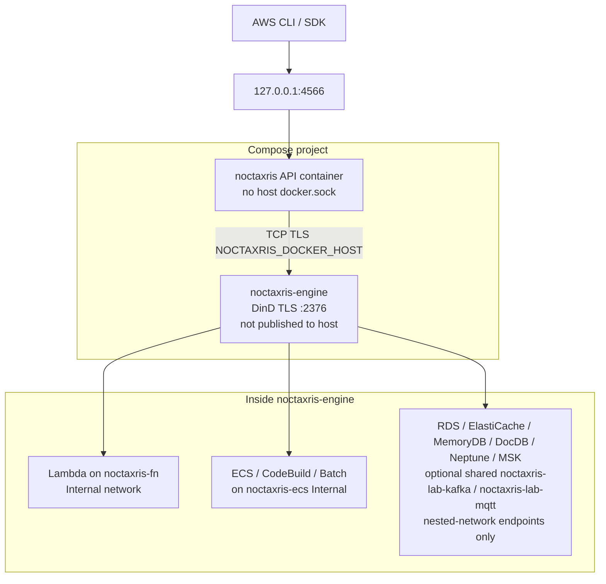
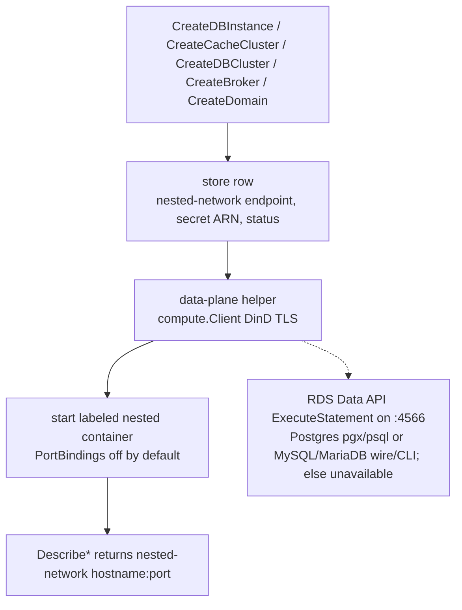

# Architecture

One Go binary runs in the API container. There is no sidecar API gateway and no host Docker socket mount. Compose also starts `noctaxris-engine` (Docker-in-Docker) on the Compose network so Lambda Invoke can run nested function containers.

Early delivery history lives under [history/](history/index.md) (history only, not a live roadmap).

## Overview

Host publish is loopback only. Nested compute and data engines talk to `noctaxris-engine` over TLS on the Compose network. The API never mounts host `docker.sock`.



## Tree

```text
Noctaxris/
  cmd/noctaxris/
  docker/                         # API image + compose (noctaxris + noctaxris-engine)
  internal/config/
  internal/compute/               # nested DinD client, Internal network, one-shot Invoke
  internal/store/                 # IAM, KMS, S3, DynamoDB, SQS, Lambda, Cognito, Gateway, orgs, IdP, ...
  internal/catalog/
  internal/kernel/audit/
  internal/kernel/authn/          # SigV4 header + query (presign)
  internal/kernel/authz/          # Evaluate*, CheckPassRole
  internal/kernel/federation/     # OIDC/SAML federation verify (go-jose v4)
  internal/kernel/jwtutil/        # shared RS256 JWKS issue/verify helper
  internal/kernel/identity/
  internal/kernel/sts/
  internal/services/
  internal/server/
  docs/                           # public docs
    docs/services/                # per-service APIs, smoke, deferred depth
```

## Request path

```text
HTTP request
  ├─ GET /_noctaxris/health → 200 ok (liveness)
  ├─ GET /_noctaxris/ready → 200 ready / 503 (SQLite ping; engine TLS dial when DockerHost set)
  ├─ GET /_noctaxris/version → 200 product semver (plain text)
  ├─ GET /cognito-idp/{region}/{pool}/.well-known/jwks.json → JWKS (no SigV4)
  ├─ /http-api/{apiId}/{stage}/{path} → Gateway invoke (NONE / JWT / IAM)
  ├─ /lambda-url/{account}/{function} → Function URL invoke
  ├─ /appsync/{apiId}/graphql → AppSync GraphQL (API_KEY / IAM / Cognito)
  └─ else
       ├─ AssumeRoleWithSAML / AssumeRoleWithWebIdentity → IdP crypto (no SigV4)
       ├─ else authn.Verify (SigV4 header or query)
       │    └─ LookupAccessKeyRecord may reuse in-process unsealed key material; Status/ExpiresAt/token still re-checked; cache drops on Delete/UpdateAccessKey
       ├─ if S3 path-style REST (service s3 / empty Action) → EvaluateS3 then handler
       ├─ GetCallerIdentity → XML (no IAM Evaluate)
       ├─ DynamoDB / SQS → EvaluateDynamoDB / EvaluateSQS then handler
       ├─ Lambda → identity or resource policy (dataplane), PassRole on role configure, then handler
       │    └─ Invoke → mint execution-role session, compute.RunInvoke via noctaxris-engine (TLS)
       ├─ Cognito / API Gateway / AppSync / edge and governance services → identity EvaluateFull then handler
       ├─ other STS / IAM / KMS / Organizations → existing Evaluate paths
       └─ unknown → 501 NotImplemented
```

Authz still loads identity/session/org policy documents on each authorize; Allow/Deny decisions are not cached.

Object bytes live under `$DATAROOT/s3/{account}/{bucket}/...`. Lambda zip contents live under `$DATAROOT/lambda/...` and are shared with DinD through the Compose `noctaxris-compute` volume. Compose keeps sealed API state on `noctaxris-data` (`state.db`, S3 bytes) and `master.key` on `noctaxris-secrets` (neither volume mounts on the engine; the engine mounts compute `:ro`). Bucket metadata, object metadata (etag, SSE), DynamoDB tables/items, SQS queues/messages, and Lambda function metadata live in SQLite. Cognito signing keys are sealed under the store master key. BCM export samples land under `$DATAROOT/bcm-exports/...`.

## Compute path

Compose sets `NOCTAXRIS_DOCKER_HOST=tcp://noctaxris-engine:2376` and `NOCTAXRIS_DOCKER_CERT_PATH=/certs/client` for TLS to the nested engine. The API process never mounts host `/var/run/docker.sock`. Runtime allowlists the Compose engine URL (extend with `NOCTAXRIS_DOCKER_HOST_ALLOWLIST`) and requires client TLS PEMs whenever Docker host is set. Default Compose runs `noctaxris-engine` as restricted DinD (`privileged: false`, explicit caps/devices, `cgroup: host`, writable `/sys/fs/cgroup`, dockerd `--ipv6=false`); see [security-defaults.md](security-defaults.md). Hosts that cannot start nested containers may opt in with `compose.engine-privileged.yaml`. The engine API is not published to the host. Function containers attach to DinD network `noctaxris-fn` with IP masquerade disabled (WAN deny; host-gateway reachability for the published lab API). Empty `NOCTAXRIS_DOCKER_HOST` disables compute so unit tests can run without DinD. Image pulls are limited to the lab registry and pinned lab bases (`NOCTAXRIS_IMAGE_PULL_ALLOWLIST` for extras).

Lambda, ECS, CodeBuild, Batch, and nested data engines all use nested DinD (`NOCTAXRIS_COMPUTE_RUNTIME` unset or `dind`). Unknown runtime values fail process start. Live zip/Image Invoke and ECS RunTask require a healthy `noctaxris-engine`. The API never falls through to host Docker.

## Nested data planes

RDS, ElastiCache, MemoryDB, DocumentDB, Neptune (Gremlin Server default; opt-in Neo4j), MQ (RabbitMQ), OpenSearch, and MSK (Redpanda) engine processes (when started) are nested containers via the same `noctaxris-engine` TLS client used for Lambda. Labels such as `noctaxris.data=rds|elasticache|memorydb|docdb|neptune|mq|opensearch|msk` identify them. Optional shared brokers (`NOCTAXRIS_SHARED_KAFKA` / `NOCTAXRIS_SHARED_MQTT`) run as fixed-name singletons on Internal `noctaxris-data` (`noctaxris-lab-kafka`, `noctaxris-lab-mqtt`) instead of per-cluster MSK containers when shared Kafka is on. The API process is not on `noctaxris-data`; the IoT MQTT shadow bridge dials `noctaxris-engine:1883` when `NOCTAXRIS_BROKER_PORT_PUBLISH` enables engine PortBindings, while DinD clients use `noctaxris-lab-mqtt:1883`. Host Compose still publishes only `127.0.0.1:4566`.



Athena queries Glue catalog metadata and lab S3 object bytes **in-process** on the API by default. Optional DuckDB HTTP sidecar (`noctaxris-lab-duck` on Internal `noctaxris-data`, or `NOCTAXRIS_DUCKDB_URL`) injects Glue views and runs SQL via a floci-duck-compatible `/query` shim; the API reaches nested DuckDB with DinD exec (no host port publish). Nested MQ, OpenSearch, and MSK promote to `RUNNING` / `Active` / `ACTIVE` only after a healthy nested container; without DinD or on start failure they fail closed (`CREATION_FAILED` / `CreateFailed` / `FAILED` with `stub://` where applicable). OpenSearch CreateFailed may include a lab `FailureReason` when nested logs match mmap / memory-lock bootstrap failures (`vm.max_map_count`). Broker, Gremlin, and search ports stay unpublished on the host by default; opt-in loopback uses `compose.lab-nested-ports.yaml` (DinD engine hop).

When DinD is unset, create paths keep control-plane rows and nested start is a no-op. Live engine start requires `noctaxris-engine`. Do not mount the operator host filesystem into nested data containers.

## Networking vocabulary

Noctaxris does not enforce Amazon VPC routing, security-group filters, or PrivateLink. EC2 exposes control-plane VPC/subnet/SG/ENI metadata only (rules are not applied on the data path). Nested compute and data engines use **DinD Internal** Docker networks (`noctaxris-fn`, `noctaxris-ecs`, `noctaxris-data`). Those are not AWS VPC private connectivity. Transfer omits `EndpointType=VPC`. Cloud Map private DNS stores a lab-opaque `Vpc` string only. Lambda `VpcConfig` and ECS `awsvpcConfiguration` fail closed.

## In-process delivery workers

- EventBridge Scheduler advances due schedules inside the API process and delivers via existing Lambda async enqueue, SQS SendMessage, and SNS Publish helpers.
- Lambda SQS event source mappings poll continuously with ReceiveMessage, synchronously Invoke, and DeleteMessage on success.
- EventBridge Pipes expose poll helpers for SQS, DynamoDB Streams, and EventBridge bus sources, with optional Lambda enrichment. An in-process ticker calls `PollPipeOnce` for RUNNING pipes.
- SNS HTTP(S) subscriptions deliver to the lab catcher by default. Exact allowlisted public URLs require `NOCTAXRIS_SNS_HTTP_EGRESS=1`, with a pinned dialer (no redirects; private/loopback/metadata hosts rejected on allowlist paths).

## Edge identity

- Cognito issues RS256 ID and access tokens and serves JWKS on the same `:4566` listener. Issuer shape: `http://127.0.0.1:4566/cognito-idp/<region>/<userPoolId>`.
- API Gateway HTTP API JWT authorizer verifies Bearer tokens via the shared jose helper against lab Cognito JWKS (in-process; no remote JWKS by default). IAM routes require SigV4 and `execute-api:Invoke` (no HTTP API resource policies).
- AppSync accepts `AMAZON_COGNITO_USER_POOLS` beside API_KEY and AWS_IAM. Custom issuers require `NOCTAXRIS_ALLOW_REMOTE_JWKS` and a public host allowlist.
- Gateway `CreateIntegration` optional `CredentialsArn` enforces PassRole plus `apigateway.amazonaws.com` trust. Without CredentialsArn, HTTP API Lambda invoke requires a function resource policy Allow for `apigateway.amazonaws.com`. AppSync Lambda data sources require the same for `appsync.amazonaws.com`.
- CloudFront remains a config-shaped stub (no real PoP). ELBv2 ALB listeners invoke Lambda targets; network LBs expose a lab HTTP shim on `/nlb/...` for IP and instance targets (unspecified and link-local forwards denied). Gateway HTTP_PROXY / VPC_LINK stay default-deny unless `NOCTAXRIS_APIGW_HTTP_PROXY=1` with allowlist.

## Authz

- Same-account identity: `Evaluate` / `EvaluateFull` (identity, boundary, SCP, RCP)
- Resource-policy dataplane (S3, SQS, Lambda, ECR, SNS, Secrets, DynamoDB): same-account Allow if identity **or** resource policy Allows (Deny-overrides). Cross-account Allow only when identity **and** resource policy both Allow. Empty resource policy denies cross-account callers.
- KMS: `EvaluateKMS`. Key-policy explicit Allow (or grant) is always required. Cross-account also needs caller identity Allow.
- Organizations SCP/RCP: collected from account attachments, OU path to root, and root. Management account exempt.
- Lambda configure: `CheckPassRole` (caller `iam:PassRole` plus `lambda.amazonaws.com` trust)
- Session policies: `EvaluateWithSession` intersection
- Cross-account AssumeRole: `EvaluateCrossAccount` (trust dual-eval, separate from resource dual-eval)
- Condition request context: populates cataloged keys such as `aws:SourceIp`, `aws:PrincipalArn`, and ResourceTag keys when present

## Identity and data

- Env-injected keys are management account root
- IAM user secrets and KMS CMK material sealed at rest
- S3 SSE-S3 DEKs sealed with the data-root master key
- SSE-KMS uses lab KMS GenerateDataKey / Decrypt under the caller
- DynamoDB item ciphertext uses table SSE (AWS-owned or customer-managed KMS)
- SQS message bodies use SSE-SQS or SSE-KMS when queue attributes request encryption
- Lambda Invoke injects temporary AWS_* credentials for the function execution role
